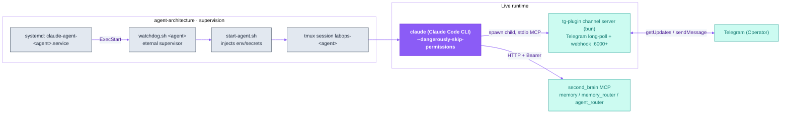

<p align="center">
  <picture>
    <source media="(prefers-color-scheme: dark)" srcset="assets/labops-logo-dark.svg">
    
  </picture>
</p>

<h1 align="center">labops-ai-assistant</h1>

<p align="center"><em>AI operations — from inside the profession</em></p>

<p align="center">
  <a href="https://labopsai.pro"></a>
  <a href="./LICENSE"></a>
  
</p>

<p align="center"><a href="README.md"><b>English</b></a> · <a href="README.ru.md">Русский</a></p>

<p align="center">
  <b>Bundles:</b>
  <a href="agent-architecture/">agent-architecture</a> ·
  <a href="tg-plugin/">tg-plugin</a>
  &nbsp;|&nbsp;
  <b>Sibling:</b>
  <a href="https://github.com/dediukhinpa/labops-second-brain">second-brain</a>
</p>

<p align="center">
  
</p>
<p align="center"><sub><i>Illustrative mockup of the two-stage reaction flow (👀 received → 👌 done) — not a screen recording.</i></sub></p>

**A self-hosted AI assistant you talk to in Telegram** — a single, long-lived Claude Code session that lives on your own server, remembers, self-heals under systemd, and grows into a swarm. This repository **combines the two layers that make that assistant run** into one deployable unit:

- **[`agent-architecture/`](agent-architecture/)** — the **runtime & lifecycle** layer: how an agent *lives*. Workspaces, layered memory, the `agent-template` scaffolder, a self-healing supervisor (`watchdog.sh → start-agent.sh → tmux → a long-lived Claude Code session`), systemd units, lifecycle hooks, and the **`create-agent`** skill the first agent uses to roll out the rest of the swarm.
- **[`tg-plugin/`](tg-plugin/)** — the **Telegram I/O channel**: a Claude Code plugin (Bun/TypeScript) that turns an ordinary `claude` session into a long-lived Telegram agent — text, voice, media, status reactions, and interactive buttons — registered as an **MCP server inside the live session**, not a headless process per message.

The third layer of the system — shared long-term memory — lives in the sibling repository **[`labops-second-brain`](https://github.com/dediukhinpa/labops-second-brain)** (Postgres + pgvector, served over MCP). It is a runtime *dependency* the agent talks to, not part of this bundle.

> [!IMPORTANT]
> **Platform:** Linux + systemd + tmux. On macOS / without systemd you can run an agent manually in tmux, but not as a service (no autostart / self-healing).

---

## Table of contents

1. [What it is](#what-it-is)
2. [Repository layout](#repository-layout)
3. [How the pieces fit](#how-the-pieces-fit)
4. [Quickstart](#quickstart)
5. [Component · agent-architecture](#component--agent-architecture)
6. [Component · tg-plugin](#component--tg-plugin)
7. [Security](#security)
8. [Data & privacy](#data--privacy)
9. [Part of labops](#part-of-labops)
10. [License](#license)

---

## What it is

In the labops system the **backend is Agent-Native**: memory, swarm, and channel are APIs/MCP *for agents*, not a UI for humans. A human (the Operator) sees only Telegram. This bundle is what turns the Claude Code "engine" into a **continuously living agent** — it gives it a workplace (a workspace with memory), a supervisor (a watchdog under systemd), lifecycle events (hooks), and a way to talk to you (Telegram).

- **One assistant, two layers, one deploy.** `agent-architecture` owns how the agent *lives*; `tg-plugin` owns how it *talks*. Together they are the complete client side of a labops agent.
- **Plugin, not gateway.** The Telegram channel registers *inside* a live Claude Code session (MCP), so every message reuses the same context, memory, skills, and billing — instead of spinning up a fresh headless `claude -p` per turn.
- **Self-bootstrapping swarm.** You install only the **first agent — Developer** — and from there it rolls out the next ones itself via the [`create-agent`](agent-architecture/) skill.
- **Nested self-healing.** systemd holds the watchdog, the watchdog holds tmux+claude, claude holds the channel server. A failure at any level is healed by the level above.
- **Truth beats memory.** The hierarchy is live check (exec/grep) → second_brain (shared brain) → git history → local memory. When memory contradicts a live check, the check wins.

| Layer | Directory | Stack | Owns |
|---|---|---|---|
| **Runtime / lifecycle** | [`agent-architecture/`](agent-architecture/) | Bash · systemd · tmux · Python | workspaces, memory, watchdog, systemd, hooks, swarm automation, `create-agent` |
| **Channel** | [`tg-plugin/`](tg-plugin/) | TypeScript · Bun · Python | Telegram long-poll, replies/reactions, voice, webhook `:6000+`, channel MCP tools |
| **Memory** *(sibling)* | [`labops-second-brain`](https://github.com/dediukhinpa/labops-second-brain) | Python · Postgres/pgvector | shared L4 memory, swarm event bus, RBAC by Bearer |

---

## Repository layout

```
labops-ai-assistant/
├── README.md              # this file (EN)
├── README.ru.md           # Русский
├── LICENSE                # Proprietary — © LabOps.ai
├── SECURITY.md            # private vulnerability reporting
├── assets/                # shared logos + demo mockups
├── agent-architecture/    # ← runtime & lifecycle layer (full repo)
│   ├── install.sh · test.sh
│   ├── agent-template/    # workspace scaffolder
│   ├── orchestration/     # watchdog, start-agent, swarm one-shots
│   ├── skills/            # create-agent + bundled skills
│   └── systemd/           # unit templates
└── tg-plugin/             # ← Telegram channel layer (full repo)
    ├── install.sh · uninstall.sh
    ├── plugin/            # Bun/TS MCP server + poller + hook webhook
    ├── webhook-listener/  # separate aiohttp a-to-a ingress
    └── docs/              # placement + setup guides
```

> [!NOTE]
> Each subdirectory keeps its **own** `README.md` / `README.ru.md`, `install.sh`, tests, and `LICENSE` — nothing was flattened or rewritten. This root adds a combined overview on top. For layer-specific detail, open the component's own README (linked in each section below).

---

## How the pieces fit

Nobody runs the agent "by hand" — **systemd** holds everything, and the agent brings itself back up after any crash. `agent-architecture` supplies the supervision and the workspace; `tg-plugin` supplies the channel that plugs into the live session; `second_brain` (sibling) supplies shared memory over MCP.



**Message flow:** user msg → 👀 reaction (poller) → MCP notification to the live session → the session thinks / calls tools → lifecycle hooks fire to the channel's `127.0.0.1:6000+` webhook (progress mirror) → the agent replies via the channel MCP tool → the `Stop` hook sets 👌.

> [!IMPORTANT]
> An incoming Telegram message does **not** go through the webhook server. Poller → MCP notification → session. The `:6000+` webhook only receives **Claude Code lifecycle hooks**, not Telegram traffic.

---

## Quickstart

Two subdirectories, **two `install.sh` scripts** — plus the sibling `second_brain`. Install the runtime first; it clones the siblings for you; then install the channel.

```bash
git clone <this-repo> labops-ai-assistant
cd labops-ai-assistant

# 1) Runtime & lifecycle — deps + Claude Code + self-test + Developer agent.
#    Also CLONES (does not install) the two sibling repos next to it.
cd agent-architecture && bash install.sh && cd ..

# 2) Telegram channel — one shared install; every agent symlinks to it.
cd tg-plugin && ./install.sh && cd ..
```

3. **Shared memory** — install the sibling `labops-second-brain` from its own repo (`sudo bash scripts/install.sh`, or hand it to a Claude Code agent following its `AGENT.md`). It issues the agent a Bearer token and brings up MCP `memory:5001` / `memory_router:5002` / `agent_router:5000`.

> [!TIP]
> For the first agent (Developer) the default model is `opus` (Opus 4.8). You install only the **first** agent — then the swarm grows itself: the Developer spawns the rest via the `create-agent` skill.

> [!IMPORTANT]
> **Model & auth.** Sign in once with `claude setup-token` (Max/Pro subscription, first-party — no third-party risk). The agent's model is set in `settings.json` (the `model` field). Model config is **operator-owned** — never change it without the owner. Without sign-in the agent starts under systemd but can't reach the model — the smoke test catches this.

> [!WARNING]
> **Never run agents as root.** They run with `--dangerously-skip-permissions`; a dedicated non-root user is expected. Secrets live in `channel.env` / `.env` / `.claude/secrets/` (`chmod 600/640`), are git-ignored, and are never committed.

Full, layer-specific instructions live in each component's README:
[`agent-architecture/README.md`](agent-architecture/README.md) · [`tg-plugin/README.md`](tg-plugin/README.md).

---

## Component · agent-architecture

> Runtime & lifecycle — how an agent *lives*. Full docs: [`agent-architecture/README.md`](agent-architecture/README.md).

- **`agent-template/`** — the scaffolder: `install.sh` renders `templates/*.template` into a per-agent workspace `~/.claude-lab/<agent-id>/.claude/` (`CLAUDE.md` = identity, `settings.json` = hooks + `model`, `.mcp.json` = second_brain endpoints). Memory is layered: identity + `core/` rules + `hot/recent.md` working set + shared second_brain over MCP.
- **`orchestration/`** — the running swarm: `watchdog.sh <agent>` is the systemd `ExecStart`; it launches `start-agent.sh` which sources `channel.env`, computes a per-agent webhook port (base `6000 + roster index`), and starts tmux session `labops-<agent>`. `lib/agents.sh` resolves the roster dynamically; `lib/notify.sh` sends throttled Telegram alerts.
- **`skills/`** — bundled Claude Code skills; **`create-agent`** is the key one — it drives a full deployment (role → scaffold → bot → voice → token → systemd → smoke) so the swarm grows itself.

<details>
<summary><b>Three levels of self-healing</b></summary>

| What is fixed | Who fixes it | How |
|---|---|---|
| frozen / dead agent session | `watchdog.sh` | detects a frozen pane → `start-agent.sh` recreates the session (`handoff.md` keeps the latest events) |
| crashed watchdog | `systemd` | `Restart=on-failure` + `RestartSec=15` |
| orphaned bun (claude died, bun on PID 1) | `watchdog.sh` / `start-agent.sh` | `pkill -9` by the agent's path |
| MCP server / worker wedged or crash-looping | `second_brain-monitor.sh` (systemd timer) | `systemctl is-active` + an HTTP `/mcp` probe → Telegram alert on the down/up transition |

</details>

---

## Component · tg-plugin

> The Telegram I/O channel. Full docs: [`tg-plugin/README.md`](tg-plugin/README.md).

A single Bun process (`plugin/src/server.ts`) plays **three roles at once**:

1. **MCP stdio server** — registered in the session's `.mcp.json` as `labops-channel`; gives Claude the channel tools (reply, ask-with-buttons, request-permission).
2. **Telegram long-poller** — pulls updates via `getUpdates` (**pull**, not webhook): no public IP/domain/TLS needed, works behind NAT. Hands an incoming message to the session as an MCP notification.
3. **Internal webhook server** (`127.0.0.1:6000+`) — listens for **Claude Code lifecycle hooks** to drive reactions and the progress mirror. This is **not** a Telegram webhook.

| Capability | What it does |
|---|---|
| **Two-stage reactions** | 👀 "received" immediately, 👌 "done" at the end of the turn |
| **Voice & media** | voice → transcription → text to the agent; photos/documents/albums buffered as attachments |
| **AskUserQuestion / Permission** | interactive option & confirmation buttons right in Telegram |
| **Progress mirror** | live "what the agent is doing now" status |
| **Security** | allowlist by user_id/chat_id, anti-spoof bot_id check, secret redaction, HTML validator, rate-limit |

> [!NOTE]
> `webhook-listener/` is a **separate** Python aiohttp service (port `6100`) for agent-to-agent ingress from `second_brain` — distinct from both the human Telegram ingress and the internal hook webhook.

---

## Security

Report vulnerabilities privately — see [`SECURITY.md`](SECURITY.md). **Do not open a public issue** for security problems; use GitHub *Security → Report a vulnerability* or email `security@labopsai.pro`.

- **Self-hosted, no telemetry.** You run it on your own server and hold your own credentials.
- **Secrets never committed.** They live in `channel.env` / `.env` / `.claude/secrets/` (`chmod 600/640`), git-ignored, guarded by `gitleaks` CI (`.github/workflows/gitleaks.yml`) and repo secret-scans.
- **Channel hardening.** Allowlist by `user_id`/`chat_id`, anti-spoof `TELEGRAM_EXPECTED_BOT_ID`, outbound secret redaction, HTML whitelist validator, Telegram rate-limiting.
- **No header → 401.** The shared brain authenticates every request by per-agent Bearer (only a salted `sha256` is stored) — never a silent fallback.

---

## Data & privacy

Self-hosted by design: agents run on the operator's own Linux server, `second_brain` (Postgres + vault) is local, and there is no telemetry. The only outbound traffic goes to the AI / messaging providers the operator configures.

| Endpoint | Purpose | When | Optional |
|---|---|---|---|
| `api.anthropic.com` (via the Claude Code engine) | LLM inference — the model the agent runs on | while the agent is active | no (core) |
| `api.telegram.org` | chat I/O — receiving and sending messages | while running | no |
| `api.groq.com` | voice transcription / synthesis | only on voice messages | yes (optional) |
| `second_brain` (`localhost` MCP, Postgres + vault) | conversation memory & state | always | local — never leaves the host |

> [!IMPORTANT]
> The only data that leaves the machine is the prompt / response traffic to the configured AI providers — which is required for any LLM agent to function. Everything else stays on the operator's host.

---

## Part of labops

| Repository | Layer | Provides |
|---|---|---|
| **agent-architecture** (bundled here) | runtime / lifecycle | workspaces, memory, watchdog/systemd, hooks, swarm automation, `create-agent` |
| **tg-plugin** (bundled here) | channel | per-agent Telegram bot, voice, reactions, webhook `:6000+`, channel MCP tools |
| **[labops-second-brain](https://github.com/dediukhinpa/labops-second-brain)** | memory | Postgres+pgvector, MCP `memory:5001` / `memory_router:5002` / `agent_router:5000` / `task:5003`, RBAC by Bearer |

---

## License

Proprietary — © 2026 LabOps.ai. All rights reserved. See [LICENSE](./LICENSE).
