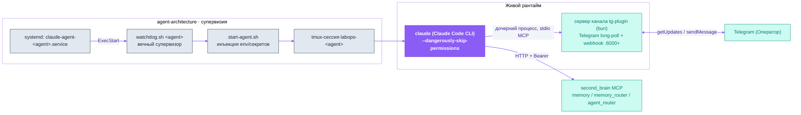

<p align="center">
  <picture>
    <source media="(prefers-color-scheme: dark)" srcset="assets/labops-logo-dark.svg">
    
  </picture>
</p>

<h1 align="center">labops-ai-assistant</h1>

<p align="center"><em>AI operations — from inside the profession</em></p>

<p align="center">
  <a href="https://labopsai.pro"></a>
  <a href="./LICENSE"></a>
  
</p>

<p align="center"><a href="README.md">English</a> · <a href="README.ru.md"><b>Русский</b></a></p>

<p align="center">
  <b>Объединяет:</b>
  <a href="agent-architecture/">agent-architecture</a> ·
  <a href="tg-plugin/">tg-plugin</a>
  &nbsp;|&nbsp;
  <b>Соседний репозиторий:</b>
  <a href="https://github.com/dediukhinpa/labops-second-brain">second-brain</a>
</p>

<p align="center">
  
</p>
<p align="center"><sub><i>Иллюстративный макет двухстадийных реакций (👀 получено → 👌 готово) — не запись экрана.</i></sub></p>

**Самостоятельно размещаемый ИИ-ассистент, с которым вы общаетесь в Telegram** — единая долгоживущая сессия Claude Code, которая работает на вашем сервере, помнит контекст, самовосстанавливается под systemd и разрастается в рой. Этот репозиторий **объединяет два слоя, на которых ассистент работает**, в один разворачиваемый комплект:

- **[`agent-architecture/`](agent-architecture/)** — слой **рантайма и жизненного цикла**: как агент *живёт*. Воркспейсы, слоистая память, скаффолдер `agent-template`, самовосстанавливающийся супервизор (`watchdog.sh → start-agent.sh → tmux → долгоживущая сессия Claude Code`), systemd-юниты, lifecycle-хуки и скилл **`create-agent`**, которым первый агент разворачивает остальной рой.
- **[`tg-plugin/`](tg-plugin/)** — **Telegram-канал ввода/вывода**: плагин Claude Code (Bun/TypeScript), превращающий обычную сессию `claude` в долгоживущего Telegram-агента — текст, голос, медиа, статус-реакции и интерактивные кнопки — зарегистрированный как **MCP-сервер внутри живой сессии**, а не отдельный headless-процесс на каждое сообщение.

Третий слой системы — общая долговременная память — живёт в соседнем репозитории **[`labops-second-brain`](https://github.com/dediukhinpa/labops-second-brain)** (Postgres + pgvector, отдаётся по MCP). Это runtime-*зависимость*, с которой агент общается, а не часть этого комплекта.

> [!IMPORTANT]
> **Платформа:** Linux + systemd + tmux. На macOS / без systemd агента можно запустить вручную в tmux, но не как сервис (нет автозапуска / самовосстановления).

---

## Оглавление

1. [Что это](#что-это)
2. [Структура репозитория](#структура-репозитория)
3. [Как всё связано](#как-всё-связано)
4. [Быстрый старт](#быстрый-старт)
5. [Компонент · agent-architecture](#компонент--agent-architecture)
6. [Компонент · tg-plugin](#компонент--tg-plugin)
7. [Безопасность](#безопасность)
8. [Данные и приватность](#данные-и-приватность)
9. [Часть labops](#часть-labops)
10. [Лицензия](#лицензия)

---

## Что это

В системе labops **бэкенд Agent-Native**: память, рой и канал — это API/MCP *для агентов*, а не UI для людей. Человек (Оператор) видит только Telegram. Этот комплект превращает «движок» Claude Code в **непрерывно живущего агента** — даёт ему рабочее место (воркспейс с памятью), супервизора (watchdog под systemd), события жизненного цикла (хуки) и способ общаться с вами (Telegram).

- **Один ассистент, два слоя, один деплой.** `agent-architecture` отвечает за то, как агент *живёт*; `tg-plugin` — за то, как он *говорит*. Вместе это полная клиентская сторона агента labops.
- **Плагин, а не шлюз.** Telegram-канал регистрируется *внутри* живой сессии Claude Code (MCP), поэтому каждое сообщение переиспользует тот же контекст, память, скиллы и биллинг — вместо запуска нового headless `claude -p` на каждый ход.
- **Самозагружающийся рой.** Вы устанавливаете только **первого агента — Developer** — а дальше он сам разворачивает следующих скиллом [`create-agent`](agent-architecture/).
- **Вложенное самовосстановление.** systemd держит watchdog, watchdog держит tmux+claude, claude держит сервер канала. Сбой на любом уровне лечится уровнем выше.
- **Истина важнее памяти.** Иерархия: живая проверка (exec/grep) → second_brain (общий мозг) → история git → локальная память. Когда память противоречит живой проверке — побеждает проверка.

| Слой | Каталог | Стек | Отвечает за |
|---|---|---|---|
| **Рантайм / жизненный цикл** | [`agent-architecture/`](agent-architecture/) | Bash · systemd · tmux · Python | воркспейсы, память, watchdog, systemd, хуки, автоматизацию роя, `create-agent` |
| **Канал** | [`tg-plugin/`](tg-plugin/) | TypeScript · Bun · Python | Telegram long-poll, ответы/реакции, голос, webhook `:6000+`, MCP-тулы канала |
| **Память** *(сосед)* | [`labops-second-brain`](https://github.com/dediukhinpa/labops-second-brain) | Python · Postgres/pgvector | общую L4-память, шину событий роя, RBAC по Bearer |

---

## Структура репозитория

```
labops-ai-assistant/
├── README.md              # английская версия
├── README.ru.md           # этот файл
├── LICENSE                # Proprietary — © LabOps.ai
├── SECURITY.md            # приватный репорт уязвимостей
├── assets/                # общие логотипы + демо-макеты
├── agent-architecture/    # ← слой рантайма и жизненного цикла (репо целиком)
│   ├── install.sh · test.sh
│   ├── agent-template/    # скаффолдер воркспейса
│   ├── orchestration/     # watchdog, start-agent, one-shots роя
│   ├── skills/            # create-agent + бандл-скиллы
│   └── systemd/           # шаблоны юнитов
└── tg-plugin/             # ← слой Telegram-канала (репо целиком)
    ├── install.sh · uninstall.sh
    ├── plugin/            # Bun/TS MCP-сервер + поллер + hook-webhook
    ├── webhook-listener/  # отдельный aiohttp-ингресс a-to-a
    └── docs/              # гайды по размещению и настройке
```

> [!NOTE]
> Каждый подкаталог сохраняет **свои** `README.md` / `README.ru.md`, `install.sh`, тесты и `LICENSE` — ничего не сплющивалось и не переписывалось. Этот корень добавляет объединённый обзор сверху. За деталями по слою — открывайте README самого компонента (ссылки в разделах ниже).

---

## Как всё связано

Никто не запускает агента «руками» — **systemd** держит всё, и агент сам поднимается после любого падения. `agent-architecture` даёт супервизию и воркспейс; `tg-plugin` даёт канал, встраивающийся в живую сессию; `second_brain` (сосед) даёт общую память по MCP.



**Поток сообщения:** сообщение пользователя → 👀 реакция (поллер) → MCP-нотификация в живую сессию → сессия думает / вызывает тулы → lifecycle-хуки летят в webhook канала `127.0.0.1:6000+` (зеркало прогресса) → агент отвечает через MCP-тул канала → `Stop`-хук ставит 👌.

> [!IMPORTANT]
> Входящее сообщение Telegram **не** идёт через webhook-сервер. Поллер → MCP-нотификация → сессия. Webhook `:6000+` принимает только **lifecycle-хуки Claude Code**, а не трафик Telegram.

---

## Быстрый старт

Два подкаталога — **два скрипта `install.sh`** — плюс соседний `second_brain`. Сначала ставим рантайм; он сам клонирует соседей; затем ставим канал.

```bash
git clone <this-repo> labops-ai-assistant
cd labops-ai-assistant

# 1) Рантайм и жизненный цикл — зависимости + Claude Code + self-test + агент Developer.
#    Также КЛОНИРУЕТ (но не устанавливает) два соседних репозитория рядом.
cd agent-architecture && bash install.sh && cd ..

# 2) Telegram-канал — одна общая установка; каждый агент делает symlink на неё.
cd tg-plugin && ./install.sh && cd ..
```

3. **Общая память** — установите соседний `labops-second-brain` из его репозитория (`sudo bash scripts/install.sh` или передайте агенту Claude Code по его `AGENT.md`). Он выдаёт агенту Bearer-токен и поднимает MCP `memory:5001` / `memory_router:5002` / `agent_router:5000`.

> [!TIP]
> Для первого агента (Developer) модель по умолчанию — `opus` (Opus 4.8). Вы устанавливаете только **первого** агента — дальше рой растёт сам: Developer порождает остальных скиллом `create-agent`.

> [!IMPORTANT]
> **Модель и авторизация.** Войдите один раз через `claude setup-token` (подписка Max/Pro, first-party — без стороннего риска). Модель агента задаётся в `settings.json` (поле `model`). Конфигурация модели — **собственность Оператора**, никогда не меняйте её без владельца. Без входа агент стартует под systemd, но не достучится до модели — smoke-тест это ловит.

> [!WARNING]
> **Никогда не запускайте агентов от root.** Они работают с `--dangerously-skip-permissions`; ожидается выделенный non-root пользователь. Секреты лежат в `channel.env` / `.env` / `.claude/secrets/` (`chmod 600/640`), в `.gitignore`, и никогда не коммитятся.

Полные инструкции по каждому слою — в README компонентов:
[`agent-architecture/README.ru.md`](agent-architecture/README.ru.md) · [`tg-plugin/README.ru.md`](tg-plugin/README.ru.md).

---

## Компонент · agent-architecture

> Рантайм и жизненный цикл — как агент *живёт*. Полная документация: [`agent-architecture/README.ru.md`](agent-architecture/README.ru.md).

- **`agent-template/`** — скаффолдер: `install.sh` рендерит `templates/*.template` в воркспейс агента `~/.claude-lab/<agent-id>/.claude/` (`CLAUDE.md` = идентичность, `settings.json` = хуки + `model`, `.mcp.json` = эндпоинты second_brain). Память по ролям: идентичность + правила `core/` + `active/` (эпизодический дневник + материализованный recall) + `passive/` (выжатые инсайты) + `archive/`, плюс общий second_brain по MCP. Консолидация событийная (in-session рефлексия на чекпойнте/простое), не по крону — см. [`agent-architecture/docs/MEMORY-REDESIGN.md`](agent-architecture/docs/MEMORY-REDESIGN.md).
- **`orchestration/`** — работающий рой: `watchdog.sh <agent>` — это systemd `ExecStart`; он запускает `start-agent.sh`, который сорсит `channel.env`, вычисляет порт webhook агента (база `6000 + индекс в ростере`) и стартует tmux-сессию `labops-<agent>`. `lib/agents.sh` резолвит ростер динамически; `lib/notify.sh` шлёт троттлированные Telegram-алерты.
- **`skills/`** — бандл-скиллы Claude Code; ключевой — **`create-agent`** — он ведёт весь деплой (роль → scaffold → бот → голос → токен → systemd → smoke), так что рой растёт сам.

<details>
<summary><b>Три уровня самовосстановления</b></summary>

| Что чинится | Кто чинит | Как |
|---|---|---|
| зависшая / мёртвая сессия агента | `watchdog.sh` | детектит замёрзшую панель → `start-agent.sh` пересоздаёт сессию (`handoff.md` хранит последние события) |
| упавший watchdog | `systemd` | `Restart=on-failure` + `RestartSec=15` |
| осиротевший bun (claude умер, bun на PID 1) | `watchdog.sh` / `start-agent.sh` | `pkill -9` по пути агента |
| зависший / крешлупящий MCP-сервер или worker | `second_brain-monitor.sh` (systemd timer) | `systemctl is-active` + HTTP-проба `/mcp` → Telegram-алерт на переходе down/up |

</details>

---

## Компонент · tg-plugin

> Telegram-канал ввода/вывода. Полная документация: [`tg-plugin/README.ru.md`](tg-plugin/README.ru.md).

Один процесс Bun (`plugin/src/server.ts`) играет **три роли одновременно**:

1. **MCP stdio-сервер** — регистрируется в `.mcp.json` сессии как `labops-channel`; даёт Claude тулы канала (ответить, спросить кнопками, запросить разрешение).
2. **Telegram long-poller** — тянет апдейты через `getUpdates` (**pull**, не webhook): не нужен публичный IP/домен/TLS, работает за NAT. Передаёт входящее сообщение в сессию как MCP-нотификацию.
3. **Внутренний webhook-сервер** (`127.0.0.1:6000+`) — слушает **lifecycle-хуки Claude Code** для реакций и зеркала прогресса. Это **не** Telegram-webhook.

| Возможность | Что делает |
|---|---|
| **Двухстадийные реакции** | 👀 «получено» сразу, 👌 «готово» в конце хода |
| **Голос и медиа** | голос → транскрипция → текст агенту; фото/документы/альбомы буферизуются как вложения |
| **AskUserQuestion / Permission** | интерактивные кнопки выбора и подтверждения прямо в Telegram |
| **Зеркало прогресса** | живой статус «что агент делает сейчас» |
| **Безопасность** | allowlist по user_id/chat_id, анти-спуф проверка bot_id, редакция секретов, HTML-валидатор, rate-limit |

> [!NOTE]
> `webhook-listener/` — **отдельный** Python aiohttp-сервис (порт `6100`) для агент-агентского ингресса от `second_brain` — отличается и от человеческого Telegram-ингресса, и от внутреннего hook-webhook.

---

## Безопасность

Сообщайте об уязвимостях приватно — см. [`SECURITY.md`](SECURITY.md). **Не открывайте публичный issue** по проблемам безопасности; используйте GitHub *Security → Report a vulnerability* или почту `security@labopsai.pro`.

- **Self-hosted, без телеметрии.** Вы запускаете это на своём сервере и держите свои учётные данные.
- **Секреты не коммитятся.** Живут в `channel.env` / `.env` / `.claude/secrets/` (`chmod 600/640`), в `.gitignore`, под защитой `gitleaks` в CI (`.github/workflows/gitleaks.yml`) и секрет-сканов репо.
- **Защита канала.** Allowlist по `user_id`/`chat_id`, анти-спуф `TELEGRAM_EXPECTED_BOT_ID`, редакция секретов на исходящих, whitelist-валидатор HTML, rate-limit Telegram.
- **Нет заголовка → 401.** Общий мозг авторизует каждый запрос per-agent Bearer-токеном (хранится только солёный `sha256`) — никогда не тихий фолбэк.

---

## Данные и приватность

Self-hosted by design: агенты работают на собственном Linux-сервере оператора, `second_brain` (Postgres + vault) локален, телеметрии нет. Единственный исходящий трафик идёт к AI/мессенджер-провайдерам, которых настроил оператор.

| Эндпоинт | Назначение | Когда | Опционально |
|---|---|---|---|
| `api.anthropic.com` (через движок Claude Code) | инференс LLM — модель, на которой работает агент | пока агент активен | нет (ядро) |
| `api.telegram.org` | I/O чата — приём и отправка сообщений | пока работает | нет |
| `api.groq.com` | транскрипция / синтез голоса | только на голосовых сообщениях | да (опционально) |
| `second_brain` (`localhost` MCP, Postgres + vault) | память разговора и состояние | всегда | локально — не покидает хост |

> [!IMPORTANT]
> Единственные данные, покидающие машину, — трафик промптов/ответов к настроенным AI-провайдерам, что необходимо для работы любого LLM-агента. Всё остальное остаётся на хосте оператора.

---

## Часть labops

| Репозиторий | Слой | Что даёт |
|---|---|---|
| **agent-architecture** (в этом комплекте) | рантайм / жизненный цикл | воркспейсы, память, watchdog/systemd, хуки, автоматизацию роя, `create-agent` |
| **tg-plugin** (в этом комплекте) | канал | per-agent Telegram-бот, голос, реакции, webhook `:6000+`, MCP-тулы канала |
| **[labops-second-brain](https://github.com/dediukhinpa/labops-second-brain)** | память | Postgres+pgvector, MCP `memory:5001` / `memory_router:5002` / `agent_router:5000` / `task:5003`, RBAC по Bearer |

---

## Лицензия

Proprietary — © 2026 LabOps.ai. All rights reserved. См. [LICENSE](./LICENSE).
