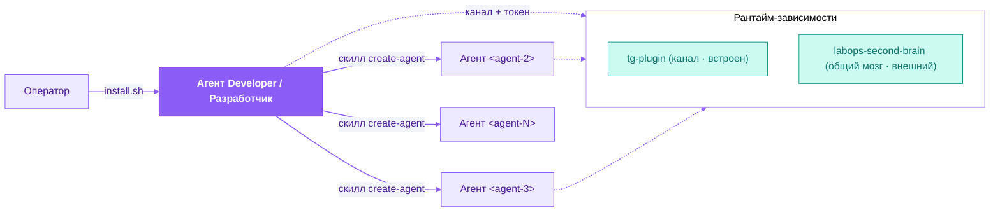
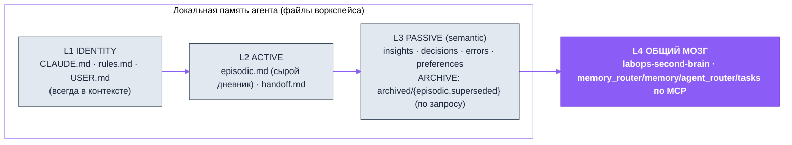

<p align="center">
  <picture>
    <source media="(prefers-color-scheme: dark)" srcset="assets/labops-logo-dark.svg">
    
  </picture>
</p>

<h1 align="center">labops-agent-architecture</h1>

<p align="center"><em>операционка с AI изнутри профессии</em></p>

<p align="center">
  <a href="https://labopsai.pro"></a>
  <a href="./LICENSE"></a>
  
</p>

<p align="center"><a href="README.md">English</a> · <a href="README.ru.md"><b>Русский</b></a></p>

<p align="center">
  <b>Система labops:</b>
  <a href="../tg-plugin">tg-plugin</a> ·
  <a href="https://github.com/dediukhinpa/labops-second-brain">second-brain</a> ·
  <b>agent-architecture</b>
</p>

**Рантайм- и lifecycle-слой агентной системы labops** — воркспейсы агентов (CLAUDE.md / rules.md / слои памяти), скаффолдер `agent-template`, пер-агентный рантайм (`watchdog.sh → start-agent.sh → tmux → долгоживущая сессия Claude Code`), systemd-юниты, хуки жизненного цикла, автоматизация роя и скилл **`create-agent`**, которым первый агент (Developer / Разработчик) разворачивает остальных агентов «под ключ».

Это **рантайм-/lifecycle-слой** системы labops. Он отвечает за то, как агент **живёт** (процессы, память, самовосстановление). Он собран вместе с Telegram-каналом в **одном монорепозитории** — `labops-ai-assistant` — и ставится единым корневым `install.sh`. Общий мозг остаётся отдельным внешним репозиторием:

- **[`labops-tg-plugin`](../tg-plugin)** — Telegram-канал: пер-агентный бот, голос, реакции, webhook. Встроен в этот монорепозиторий (ставится корневым `install.sh`).
- **[`labops-second-brain`](https://github.com/dediukhinpa/labops-second-brain)** — общая память: MCP `memory:5001` / `memory_router:5002` / `agent_router:5000` / `task:5003`. Отдельный репозиторий (рантайм-зависимость); агент получает Bearer-токен и читает/пишет через MCP.

> [!IMPORTANT]
> **Платформа:** Linux + systemd + tmux. На macOS/без systemd агент можно гонять вручную в tmux, но не как службу (нет автозапуска/самовосстановления).

---

## Содержание

1. [Зачем labops](#зачем-labops)
2. [Быстрый старт](#быстрый-старт)
3. [Архитектура рантайма](#архитектура-рантайма)
4. [Слои памяти агента](#слои-памяти-агента)
5. [agent-template — скаффолдер](#agent-template--скаффолдер)
6. [Скилл `create-agent` (end-to-end)](#скилл-create-agent-end-to-end)
7. [Хуки жизненного цикла и автоматизация роя](#хуки-жизненного-цикла-и-автоматизация-роя)
8. [Скиллы в комплекте](#скиллы-в-комплекте)
9. [Установка и модель/авторизация](#установка-и-модельавторизация)
10. [Переменные и настройки](#переменные-и-настройки)
11. [Если что-то не работает](#если-что-то-не-работает)
12. [FAQ](#faq)
13. [Данные и приватность](#данные-и-приватность)
14. [Часть системы labops](#часть-системы-labops)
15. [Лицензия](#лицензия)

---

## Зачем labops

В системе labops **бэкенд устроен Agent-Native**: память, рой и канал — это API/MCP *для агентов*, а не интерфейс для человека. Человеку (Оператору) виден только Telegram. Этот репозиторий — то, что превращает «движок» Claude Code в **постоянно живущего агента**: даёт ему рабочее место (воркспейс с памятью), супервизора (watchdog под systemd), события жизненного цикла (хуки) и связь с роем.

- **Самозагрузка роя.** Не нужно вручную поднимать каждого агента. Вы устанавливаете **первого агента — Developer / Разработчик**, а дальше он сам, через скилл [`create-agent`](#скилл-create-agent-end-to-end), разворачивает следующих.
- **Одна установка — дальше рой растёт сам.** `create-agent` скаффолдит воркспейс, регистрирует Telegram-бота, подключает голос, выдаёт second_brain-токен, ставит автозапуск под systemd и прогоняет smoke-тест — развёртывание агентов становится операцией самого роя, а не ручной процедурой оператора.
- **Вложенное самовосстановление.** systemd держит watchdog, watchdog держит tmux+claude, claude держит канал-сервер. Падение на любом уровне лечится уровнем выше.
- **Проверка побеждает память.** Иерархия истины: live-проверка (exec/grep) → second_brain (общий мозг) → git-история → локальная память. Память противоречит проверке — побеждает проверка.
- **Честная установка.** Если чего-то нет — установка честно перечислит, что **не** настроено (а не покажет ложный зелёный).



Границы ответственности трёх слоёв:

| Компонент | Слой | Отвечает за |
|---|---|---|
| **agent-architecture** (этот · встроенный) | Рантайм / lifecycle | воркспейсы, память, watchdog, systemd, хуки, автоматизация роя, скилл `create-agent` |
| **tg-plugin** (встроен в этот монорепозиторий) | Канал | приём из Telegram (long-poll), отправка ответов/реакций, голос, webhook `:6000+` |
| **labops-second-brain** (внешний репозиторий) | Память | Postgres+pgvector, MCP memory/memory_router/agent_router/task, RBAC по Bearer-токенам |

---

## Быстрый старт

Остальное в README можно читать по мере надобности — для первого агента достаточно:

**Единый корневой `install.sh`** (в корне монорепозитория `labops-ai-assistant`) — единственная точка входа: он ставит **оба** встроенных компонента — `agent-architecture` (этот слой) и `tg-plugin` (канал) — за один прогон и **клонирует** (но не устанавливает) внешний `labops-second-brain`, который вы ставите отдельно.

1. **Запускаем корневой установщик — одна команда делает всё встроенное:** `bash install.sh` — сначала устанавливает tmux/git/curl/jq/unzip (нужен root/sudo); если запущен от root, дальше предлагает создать отдельного непривилегированного пользователя (агенты работают через `--dangerously-skip-permissions`, под root это небезопасно — а системные пакеты к этому моменту уже стоят, так что остальной установке sudo не нужен) и перезапускает себя от его имени; затем устанавливает Claude Code (нативный установщик, Node.js не нужен), ставит встроенный `tg-plugin`, клонирует рядом с монорепозиторием `labops-second-brain` (не устанавливая его), прогоняет self-test, спрашивает авторизацию (интерактивный `/login` в TUI Claude Code, подписка Max/Pro), если вы ещё не входили, и создаёт Developer-агента: спросит имя/модель/Telegram-бота, всё развернёт и прогонит smoke (модель по умолчанию `opus`/Opus 4.8). Если `labops-second-brain` ещё не установлен — агент стартует в деградированном режиме, установщик подскажет, чего не хватает. Хотите создать агента позже сами? `bash install.sh --no-agent` останавливается прямо перед авторизацией/созданием агента. (Корневой установщик сам вызывает `install.sh` каждого компонента — руками их запускать не нужно.)
2. **Ставим `labops-second-brain`** — свой внешний репозиторий, своя установка: см. [его Quickstart](https://github.com/dediukhinpa/labops-second-brain#quickstart) (вручную `scripts/install.sh`, либо отдать Claude Code агенту по `AGENT.md`).

> [!TIP]
> Для Developer модель по умолчанию `opus` (Opus 4.8). Вы ставите только первого агента — дальше рой растёт сам: Developer разворачивает остальных через скилл `create-agent`.

```bash
# Из корня монорепозитория labops-ai-assistant.
# Одна команда: зависимости + self-test + авторизация (если нужна) +
# Developer-агент. Она ставит ОБА встроенных компонента (agent-architecture +
# tg-plugin) и клонирует (но не устанавливает) внешний
# labops-second-brain -> ~/labops-second-brain.
bash install.sh   # модель → идентичность → скаффолд → бот → голос → токен → systemd → smoke
```

Корневой `install.sh` ставит оба встроенных компонента (`agent-architecture` + `tg-plugin`) и клонирует `labops-second-brain` в `~/labops-second-brain` — единственный внешний репозиторий, который вы ставите сами (шаг 2 выше, там же ссылка на его Quickstart). Если чего-то нет — установка честно перечислит, что **не** настроено (а не покажет ложный зелёный).

---

## Архитектура рантайма

Никто не запускает агентов «вручную» — всё держит **systemd**, и агент сам себя поднимает после любого падения. Страховка **вложенная**: systemd держит watchdog → watchdog держит tmux+claude → claude держит канал-сервер (bun). Падение на любом уровне лечится уровнем выше.

```mermaid
%%{init: {'theme':'base','themeVariables':{'primaryColor':'#EDE9FE','primaryTextColor':'#4C1D95','primaryBorderColor':'#8B5CF6','lineColor':'#8B5CF6','secondaryColor':'#F1F5F9','tertiaryColor':'#ffffff','clusterBkg':'transparent','clusterBorder':'#B794F4','fontFamily':'Helvetica,Arial,sans-serif'}}}%%
flowchart LR
  subgraph boot["Загрузка · надзор"]
    direction TB
    SD["systemd: claude-agent-&lt;agent&gt;.service<br/>Restart=on-failure, RestartSec=15"]
    WD["watchdog.sh &lt;agent&gt;<br/>вечный надзиратель (демон)"]
    SA["start-agent.sh &lt;agent&gt;<br/>создаёт сессию; окружение собирает session-exec.sh в панели"]
    TM["tmux-сессия labops-&lt;agent&gt;"]
    SD -->|ExecStart| WD
    WD -->|если сессии нет / зависла| SA
    SA -->|tmux new-session| TM
  end
  subgraph live["Живой рантайм"]
    direction TB
    CC["claude (Claude Code CLI)<br/>--dangerously-skip-permissions<br/>server:labops-channel"]
    BUN["канал-сервер (bun, labops-tg-plugin)<br/>Telegram long-poll + webhook :6000+"]
    SB["second_brain MCP<br/>memory:5001 / memory_router:5002 / agent_router:5000"]
  end
  TM --> CC
  CC -->|spawn child, stdio MCP| BUN
  CC -->|HTTP + Bearer| SB
  BUN <-->|getUpdates / sendMessage| TG["Telegram (Оператор)"]
  classDef brand fill:#8B5CF6,stroke:#6D28D9,color:#ffffff,font-weight:bold
  classDef ext fill:#CCFBF1,stroke:#0D9488,color:#0F766E
  classDef store fill:#FEF3C7,stroke:#D97706,color:#92400E
  classDef sys fill:#E2E8F0,stroke:#334155,color:#1E293B
  linkStyle default stroke:#8B5CF6,stroke-width:1.5px
  class CC brand
  class SD,WD,SA,TM sys
  class BUN,SB,TG ext
```



**Цепочка запуска:**

1. **systemd** поднимает службу `claude-agent-<agent>.service` (одна на агента). Главный процесс службы — не `claude`, а `watchdog.sh`.
2. **`watchdog.sh <agent>`** — долгоживущий демон. Если tmux-сессии нет или панель зависла, зовёт `start-agent.sh`. Заодно «реапит» осиротевший канал-сервер (bun).
3. **`start-agent.sh <agent>`** создаёт tmux-сессию `labops-<agent>`, а командой панели ставит **`session-exec.sh <agent>`**. Тот через `lib/agent-env.sh::resolve_agent_env` собирает окружение уже **внутри панели** — читает секреты из `channel.env` и `.claude/secrets/` (chmod 600, никогда не хардкодятся), source'ит `agent.env` (second_brain-переменные попадают в сессию только при реальном `AGENT_BEARER` — плейсхолдер `CHANGE_ME` вычищается и оставляет recall выключенным) — и делает `exec` в `claude --settings <workspace>/settings.json … server:labops-channel` (явный `--settings` обязателен: cwd-симлинк воркспейса Claude Code канонизирует, и хуки иначе не грузятся). Готовность проверяется по фактам, а не тексту TUI: слушается webhook-порт канала и/или продвинулся heartbeat-файл (текущие сборки claude строку `Listening for channel` не печатают).
4. **`claude`** (движок) грузит канал-плагин, спавнит дочерний bun-процесс канала по stdio и подключает MCP second_brain по HTTP+Bearer.

### Модель живости (self-healing) в `watchdog.sh`

> [!NOTE]
> Watchdog снимает «хвост» панели tmux каждые ~30 c и классифицирует состояние. Единственный надёжный маркер «идёт ход» — футер **`esc to interrupt`**: Claude Code показывает его всё время хода и убирает в момент завершения. Строку с таймером (`Cooked for Ns`) использовать нельзя — она остаётся на экране после хода и в прошлом приводила к ложным рестартам простаивающего агента.

Два «тихих» режима сбоя, оба невидимы для наивной проверки промпта (зависший TUI всё ещё рисует `❯`):

| Режим | Признак | Реакция watchdog |
|---|---|---|
| **(A) Замёрзший ход** (frozen turn) | `esc to interrupt` присутствует, но панель байт-в-байт не меняется (таймер встал) | подтверждение через ~60 c (2 цикла) → рестарт сессии |
| **(B) Застрявший ввод** (stuck input) | в `❯` лежит неотправленный inbound, активного хода нет | эскалация: `Enter` → `Escape`+`Enter` (коммит bracketed-paste) → рестарт |
| Потерян промпт | TUI не рендерит ни `❯`, ни `bypass permissions` | рестарт — но свежий heartbeat-файл его откладывает |
| Чистый idle-промпт | `❯` есть, поле ввода пустое | **не трогать** (здоровый агент); после ~10 мин простоя один раз дёрнуть in-session консолидацию памяти |

Режим (B) срабатывает **только** при непустом поле ввода — иначе чистый idle-промпт никогда не тревожится (это была главная причина «молчащих» агентов до фикса nbsp-парсинга `❯`). Отдельная защита — реапинг **осиротевшего bun**: если родительский `claude` умер, а канал-сервер «завис» с `PPID==1`, он на 2-ядерном боксе уходит в EPIPE-петлю на ~90 % CPU и душит живые сессии; watchdog/start-agent убивают его `pkill` строго по пути конкретного агента.

<details>
<summary><b>Три уровня самовосстановления</b></summary>

| Что чинит | Кто чинит | Как |
|---|---|---|
| зависшая / мёртвая сессия агента | `watchdog.sh` | детектит застывшую панель → `start-agent.sh` пересоздаёт сессию (`handoff.md` хранит последние события) |
| упавший watchdog | `systemd` | `Restart=on-failure` + `RestartSec=15` |
| осиротевший bun (claude умер, bun на PID 1) | `watchdog.sh` / `start-agent.sh` | `pkill -9` по пути агента |
| сервисы second_brain | `systemd` | отдельные службы `second_brain-*.service` |
| MCP-сервер / воркер завис или в crash-loop | `second_brain-monitor.sh` (systemd-таймер, ~60 с) | `systemctl is-active` + дельта рестартов + HTTP-проба `/mcp` (ловит *жив, но завис*) → Telegram-алерт на переходе down/up |

</details>

> **Зачем юниту явный `ExecStop`.** tmux-сервер общий на весь рой и попадает в
> cgroup того агента, который поднял его первым, — поэтому дефолтный
> `KillMode=control-group` бьёт мимо той самой сессии, которую собирался снять.
> До починки `systemctl restart claude-agent-<не-владелец>` оставлял старую
> сессию жить (правка конфига молча не доезжала до агента), а остановка
> *владельца* разом роняла сессии всех агентов. Теперь юнит идёт с
> `KillMode=process` и `ExecStop=stop-agent.sh <агент>`: каждый снимает своего
> агента и не трогает ни общий сервер, ни соседей.

> **Цели tmux — только точные.** Все скрипты обращаются к сессии агента как
> `=<имя>` (`tmux has-session -t "=labops-app"`), а к его панели — как
> `=<имя>:^.{top-left}`. Без `=` tmux, не найдя точной сессии, берёт первую, чьё
> имя лишь *начинается* так же: 10.09.2026 watchdog `labops-app` принял
> `labops-app-124546645` за свою сессию и так и не поднял агента. Для панели мало
> и `=<имя>:` — это *текущее* окно сессии: откроет оператор в сессии агента второе
> окно, и клавиши, снимки экрана и `pane_pid` для детекта дрейфа версии уйдут в
> bash этого окна (ложный рестарт). `^` — окно с наименьшим номером, то есть окно
> агента, созданное первым, `{top-left}` — его верхняя левая панель при любых
> `base-index`/`pane-base-index`. Соблюдение проверяет
> `scripts/check_tmux_targets.py` (секция 22 self-test) — в bash, Python и
> TypeScript, здесь и в `../tg-plugin`; осознанное исключение помечается в той же
> строке `tmux-target-ok: <почему>`. Тесты с настоящими сессиями работают в своём
> tmux-сервере (`orchestration/lib/tmux-test-isolation.sh`): в панели агента
> `$TMUX` указывает на сервер роя и перекрывает `TMUX_TMPDIR`, так что
> `kill-server` из теста иначе снёс бы всех агентов.

> [!NOTE]
> **Алерты оператору.** На каждое из этих событий watchdog ещё и пишет оператору в Telegram (через бота агента, `tg-send.sh` → `lib/notify.sh`): перезапуск сессии **с причиной**, потерянный/неотрисованный промпт, застрявший неотправленный промпт и подбор осиротевшего канал-сервера. Алерты best-effort (упавшая отправка никогда не ломает watchdog) и троттлятся по каждому сообщению, поэтому флаппинг не спамит. Включается через `WATCHDOG_TG_ALERTS` (по умолчанию `1`), окно троттлинга — `WATCHDOG_ALERT_COOLDOWN` (секунды, по умолчанию `300`), отдельный чат — `WATCHDOG_ALERT_CHAT_ID`. Тот же `lib/notify.sh` питает и **`second_brain-monitor.sh`** — systemd-таймер, который следит за MCP-серверами и воркерами (`systemctl is-active` + HTTP-проба `/mcp`, ловящая *жив, но завис*, + детект crash-loop) и алертит на тот же канал; укажи `MONITOR_AGENT` — агента, чей бот рассылает ops-алерты.

> **Подхват обновления Claude Code.** Нативный установщик обновляет CLI сам — качает новую сборку в `~/.local/share/claude/versions/<версия>` и перекидывает `~/.local/bin/claude`. Уже запущенный процесс продолжает исполнять старый inode, поэтому сессия, которая пересоздаётся только при поломке, сидит на устаревшей сборке неделями (замер 08.09.2026: сессии отставали на две версии и пять дней). Это важно не только из-за исправлений: алиасы моделей (`opus`, `sonnet`, `fable`) резолвит сам CLI при старте сессии, так что старый бинарь тихо держит агента на предыдущем поколении модели, а про новый алиас просто не знает. Watchdog сверяет бинарь, который исполняет сессия, с тем, что лежит на диске, и перезапускает сессию под новую версию — **только из ветки чистого простоя** и после `WATCHDOG_CLI_UPDATE_IDLE_CYCLES` (по умолчанию `2`, ~1 минута) циклов простоя, чтобы никогда не оборвать идущий ход. Детект fail-open: любая неопределённость — это «дрейфа нет».

---

## Слои памяти агента

Память организована по **роли**, а не по возрасту, и делится на два *рода*: **эпизодическую** (сырой дневник событий) и **семантическую** (выжатые инсайты — что понято). `active/` — сырой дневник и handoff, `passive/` — курируемое семантическое знание, `archive/` — холодное хранилище; четвёртый слой — общий мозг `labops-second-brain` по MCP. Консолидация (episodic → passive-инсайты) **событийная, а не по крону**: живую сессию «подталкивают» к рефлексии на чекпойнте (каждые ~20 ходов) или после ~10 мин простоя — фонового вызова модели нет (`claude -p` запрещён). Иерархия истины: **live-проверка (exec/grep) → second_brain (общий мозг) → git-история → локальная память**. Память противоречит проверке — побеждает проверка.



| Слой | Файлы / источник | В контексте | Кто правит |
|---|---|---|---|
| **L1 Идентичность** | `CLAUDE.md`, `rules.md`, `USER.md` | всегда (`@import`) | оператор; агент — только по его просьбе (RED-зона) |
| **L2 Active** | `active/episodic.md` (сырой дневник, с salience-тегами), `active/handoff.md` | только `handoff.md`; дневник читает консолидация | `active-writer.sh` (Stop-хук) пишет episodic |
| **L3 Passive** (semantic) | `passive/insights.md · decisions.md · errors.md · preferences.md` (инсайты + decay-frontmatter) | `decisions.md` + `preferences.md` всегда; остальное по запросу | **живая сессия** на рефлексии (скилл `memory-consolidate`); `decay-sweep.sh` вычищает всё, кроме `preferences.md` |
| **ARCHIVE** | `archived/episodic/YYYY-MM.md`, `archived/superseded/` | нет — по запросу (Read) | `archive-roll.sh` / `decay-sweep.sh` (чистый bash) |
| **L4 Общий** | second_brain `memory_router` / `memory` / `agent_router` / `tasks` (доска) | нет — по запросу (MCP) | по RBAC-scopes (dual-write на рефлексии) |

Episodic **никогда не сжимается моделью** — только скручивается по размеру в `archived/episodic/`; семантический слой *синтезируется* из него (обратимо через `provenance`). Зоны доступа к файлам: **RED** (`CLAUDE.md`, `rules.md`, `USER.md`) — только оператор; **YELLOW** (`passive/*`, `AGENTS.md`, `TOOLS.md`) — агент с обоснованием; **GREEN** (`active/episodic.md`) — пишет Stop-хук сам.

**Политика записи в общий мозг** зафиксирована в [`SECONDBRAIN_WRITE_RULES.md`](SECONDBRAIN_WRITE_RULES.md) — это единый canonical-файл (RED-зона). `agent-template/install.sh` копирует его в корень воркспейса рядом с `AGENT_ROUTER.md`, и оба **@-импортятся в `CLAUDE.md`** (`@SECONDBRAIN_WRITE_RULES.md`, `@AGENT_ROUTER.md`). До 02.09.2026 ни один документ не копировался вовсе — поллер отсылал агента к `AGENT_ROUTER.md`, которого в воркспейсе не существовало. Четыре дисциплины: (1) `recall` **перед** записью — не плодить дубли; (2) **dual-write** важного — и в локальный `.md`, и в second_brain (идемпотентно по sha256); (3) писать **сразу**, не «потом» (компакция знания не выгружает); (4) писать в свой `scope`. Инструменты записи жёстко зафиксированы кодом: `create_decision_note`, `create_error_pattern_note`, `create_external_note`, `create_personal_note` (→ `personal`), `create_project_note` (→ `projects`), `create_handoff`, `append_daily_log`, `supersede_decision`.

---

## agent-template — скаффолдер

[`agent-template/`](agent-template/) — полный шаблон воркспейса Claude Code, проводнённый к общему `labops-second-brain` (memory + memory_router + agent_router + tasks). Интерактивный `install.sh` спрашивает идентичность агента и параметры подключения к мозгу, рендерит шаблоны и собирает воркспейс в `~/.claude-lab/<agent-id>/.claude/`.

**Промпты при скаффолде** (попадают в плейсхолдеры `CLAUDE.md`): имя (`{{AGENT_NAME}}`), роль (`{{AGENT_ROLE}}` / `{{AGENT_ROLE_DESCRIPTION}}`), характер (`{{CHARACTER_TRAITS}}`), как обращаться к оператору, язык ответов, модель; плюс параметры мозга — `MCP_HOST` (только хост/IP), `AGENT_BEARER`, `AGENT_SCOPES`. Четыре переменные per-service (`SECOND_BRAIN_MEMORY_URL`, `SECOND_BRAIN_MEMORY_ROUTER_URL`, `SECOND_BRAIN_AGENT_ROUTER_URL`, `SECOND_BRAIN_TASKS_URL`) выводятся автоматически из `MCP_HOST`, но могут быть переопределены напрямую.

**Что генерируется:**

```
~/.claude-lab/<agent-id>/.claude/
├── CLAUDE.md            # SOUL / идентичность (из templates/CLAUDE.md.template)
├── .mcp.json            # ТОЛЬКО 4 сервера second_brain (memory/memory_router/agent_router/tasks), chmod 600
├── settings.json        # хуки SessionStart / Stop / PreCompact / SessionEnd (+ heartbeat на каждом событии)
├── agent.env            # source перед запуском: MCP_HOST / SECOND_BRAIN_*_URL / AGENT_BEARER
├── core/
│   ├── USER.md · rules.md · AGENTS.md
│   ├── passive/{decisions,preferences}.md   # PASSIVE, в контексте; errors/insights появляются с консолидацией
│   └── active/{episodic.md, handoff.md, archived/, pre-compact/}
├── tools/TOOLS.md
├── scripts/             # episodic-писатель, reflect-nudge, decay/archive housekeeping,
│                       #   brain-flush, mcp-call helper, поллер доски задач
├── hooks/               # session-start, stop, precompact, heartbeat
├── logs/
└── skills/              # симлинк на общий бандл скиллов
```

| Каталог шаблона | Содержимое |
|---|---|
| `templates/` | `CLAUDE.md`, `rules.md`, `USER.md`, `tools.md`, `agents.md`, `decisions.md`, `preferences.md`, `episodic.md`, `mcp.json`, `settings.json`, `global-CLAUDE.md` |
| `hooks/` | `session-start-hook.sh`, `stop-hook.sh`, `precompact-hook.sh`, `heartbeat-hook.sh` |
| `scripts/` | `active-writer.sh`, `reflect-nudge.sh`, `decay-sweep.sh`, `archive-roll.sh`, `brain-flush.sh`, `mcp-call.sh`, `task-poller.sh` + `task_poller.py` |
| `docs/` | `ARCHITECTURE.md`, `MEMORY.md`, `HOOKS.md`, `MULTI-AGENT.md`, `SETUP-GUIDE.md`, `AGENT-LAWS.md`, … (15 файлов) |

Важно: `mcp.json.template` подключает агенту **только** second_brain — теперь это **4 сервера**, включая доску задач (`:5003`): она и есть межагентный канал роя, поэтому доска заводится каждому агенту, и скоуп `task-board` выдаётся по умолчанию. Канал (`labops-channel`) по-прежнему грузится отдельно при запуске через `claude … server:labops-channel`. Два документа, задающих правила общей памяти и маршрутизации, — `SECONDBRAIN_WRITE_RULES.md` и `AGENT_ROUTER.md` — копируются в корень воркспейса и подключаются через `@`-импорт из `CLAUDE.md`. Крон здесь не нужен: housekeeping едет на Stop-хуке, а поллер доски надзирается watchdog'ом.

---

## Скилл `create-agent` (end-to-end)

> Лежит в `skills/create-agent/`. Это **ядро репозитория** — то, чем первый агент (Developer) разворачивает остальных. Описание ниже — целевое поведение скилла; он авторится параллельно лидом.

Когда Оператору нужен новый агент, он просит об этом Developer-агента в Telegram. Тот запускает скилл `create-agent`, который проводит развёртывание целиком — от диалога о роли до прошедшего smoke-теста — не требуя ручных шагов от оператора.

```mermaid
%%{init: {'theme':'base','themeVariables':{'primaryColor':'#EDE9FE','primaryTextColor':'#4C1D95','primaryBorderColor':'#8B5CF6','lineColor':'#8B5CF6','secondaryColor':'#F1F5F9','tertiaryColor':'#ffffff','clusterBkg':'transparent','clusterBorder':'#B794F4','fontFamily':'Helvetica,Arial,sans-serif'}}}%%
flowchart LR
  subgraph c1["Определить · скаффолд"]
    direction TB
    S1["1. Диалог: роль и имя<br/>(чем агент занимается, как зовётся)"]
    S2["2. Идентичность: провести по CLAUDE.md / USER.md<br/>(характер, зоны, профиль оператора)"]
    S3["3. Скаффолд воркспейса<br/>agent-template → ~/.claude-lab/&lt;agent&gt;/.claude"]
    S4["4. Telegram-бот<br/>@BotFather → токен → channel.env"]
    S1 --> S2 --> S3 --> S4
  end
  subgraph c2["Провижн · проверка"]
    direction TB
    S5["5. Голос<br/>скилл groq-voice (GROQ_API_KEY)"]
    S6["6. second_brain-токен<br/>Bearer + scopes от labops-second-brain"]
    S7["7. Автозапуск<br/>systemd-юнит + watchdog"]
    S8["8. Smoke-тест<br/>проверка канала, memory_router, agent_router, реакций"]
    S5 --> S6 --> S7 --> S8
  end
  S4 --> S5
  classDef brand fill:#8B5CF6,stroke:#6D28D9,color:#ffffff,font-weight:bold
  classDef ext fill:#CCFBF1,stroke:#0D9488,color:#0F766E
  classDef store fill:#FEF3C7,stroke:#D97706,color:#92400E
  classDef sys fill:#E2E8F0,stroke:#334155,color:#1E293B
  linkStyle default stroke:#8B5CF6,stroke-width:1.5px
  class S1 brand
  class S4,S5,S6 ext
  class S7 sys
```



| Шаг | Что делает | Артефакт |
|---|---|---|
| 1. Роль и имя | спрашивает у Оператора роль (кодер / контент / ресёрч / …) и `<agent-id>` | — |
| 2. Идентичность | проводит по `CLAUDE.md` (SOUL, характер, принципы) и `rules.md` | заполненные RED-файлы |
| 3. Скаффолд | прогоняет `agent-template` → рендерит шаблоны | `~/.claude-lab/<agent>/.claude/` |
| 4. Telegram-бот | регистрирует бота через `@BotFather`, пишет токен | `channel.env` (`/etc/labops-plugin/<agent>/` или `shared/state/<agent>/telegram/`) |
| 5. Голос | подключает скилл `groq-voice` (транскрипция `.ogg`) | `GROQ_API_KEY` в секретах |
| 6. Токен мозга | запрашивает у `labops-second-brain` Bearer + `scopes` | `.mcp.json` (chmod 600) |
| 7. Автозапуск | ставит `claude-agent-<agent>.service` + watchdog, добавляет в roster | юнит + строка в `agents.conf` |
| 8. Smoke-тест | финальная проверка: канал слушает, memory_router/agent_router отвечают, реакции ставятся | зелёный прогон |

Токен Telegram-бота извлекается **не из хардкода**, а из `channel.env` через `orchestration/lib/agents.sh::agent_bot_token` (ищет `/etc/labops-plugin/<agent>/channel.env`, затем `$CLAUDE_LAB/shared/state/<agent>/telegram/channel.env`).

---

## Хуки жизненного цикла и автоматизация роя

### Хуки жизненного цикла

Хук — **не сервер**: движок Claude Code в определённый момент испускает событие, читает `settings.json`, спавнит команду как дочерний процесс (на stdin — JSON с путём к транскрипту и `session_id`), скрипт отрабатывает за миллисекунды-секунды и выходит. Все три хука **fail-open**: любая ошибка → `exit 0`, харнесс никогда не подвисает. Подробнее о загрузке `settings.json` — в `labops-tg-plugin/docs/06`.

| Событие | Хук (`agent-template/hooks/`) | Что делает |
|---|---|---|
| **SessionStart** | `session-start-hook.sh` | логирует старт и есть ли что-то в `handoff.md`. Поиск в памяти под задачу агент делает сам — так велит `CLAUDE.md`. В рое также `agent-boot-sequence.sh`: 👀 на свежие сообщения + `agent_router.list_my_pending()` (pull-страховка) |
| **Stop** | `stop-hook.sh` | дописывает salience-тегированную episodic-запись в `active/episodic.md` (через `active-writer.sh`) + подробную JSON-строку в `logs/verbose-*.jsonl`; инкрементит счётчик ходов и каждые ~20 ходов дёргает in-session консолидацию (`reflect-nudge.sh`); не чаще раза в сутки фоном запускает housekeeping (`decay-sweep.sh` + `archive-roll.sh`) — ротация теперь дефолт, а не опциональный cron. В рое также `read-receipt-hook.ts` (POST `/hooks/react` → 👌) и `reflect-error-pattern.sh` |
| **PreCompact** | `precompact-hook.sh` | снапшотит `active/episodic.md` в `active/pre-compact/` перед авто-компакцией, держит последние `KEEP_SNAPSHOTS` (10); затем `brain-flush.sh` — страховочный сброс handoff + хвоста episodic в inbox общего мозга (`create_handoff`, fail-open, sha-дедуп, no-op при плейсхолдере `CHANGE_ME`) |
| **SessionEnd** | `scripts/brain-flush.sh --reason session-end` | тот же страховочный flush в конце сессии — второй момент, где знания иначе теряются |

Все хуки несут `sdk-guard`: при `CLAUDE_SDK_CHILD=1` (или `entrypoint=sdk-ts`) сразу выходят, чтобы не зацикливаться в дочерних Agent-SDK-сессиях.

### Автоматизация роя

Большинство скриптов в [`orchestration/`](orchestration/) — «однодневки» по триггеру (cron / событие). Исключение — **поллер доски**: `lib/task-poller-launch.sh` (его сорсят и `watchdog.sh`, и `start-agent.sh`) держит по одному долгоживущему демону на агента — `agent-template/scripts/task-poller.sh` надзирает за `task_poller.py`, который держит одну MCP-сессию и опрашивает доску раз в 5 с. До 02.09.2026 это был bash-цикл с рукопожатием на каждый тик; переписывание срезало расход с ~8% ядра до ~0.3%. Roster агентов берётся через `orchestration/lib/agents.sh::list_agents` — **не хардкодом**: сначала `$CLAUDE_LAB/agents.conf` (по строке на agent-id, см. `agents.conf.example`), иначе скан `$CLAUDE_LAB/*/.claude` с исключением инфра-каталогов (`shared`, `logs`, `mcp-servers`).

<details>
<summary><b>Скрипты оркестрации</b></summary>

| Скрипт | Триггер | Назначение |
|---|---|---|
| `heartbeat-all.sh` | cron, раз в минуту | heartbeat только живых tmux-сессий → супервизор отличает живых агентов от мёртвых (у мёртвых `last_seen` устаревает, их задачи реклеймятся) |
| `night-learnings.sh` | cron, 02:00 UTC | ночной learnings-цикл: `agent_router.notify` каждому → review 7-дневных learnings → обновить `rules.md` |
| `message-reaction-daemon.sh` | фоновый демон на агента | ставит 👀 на **все** входящие (текст/голос/стикеры) немедленно, опрос каждые ~3 c |
| `start-reaction-daemons.sh` | `@reboot` | поднимает reaction-демоны для всех агентов roster, с PID-файлами |
| `set-message-reaction.sh` / `handle-incoming-messages.sh` | вспомогательные | примитивы реакций и обработки входящих |
| `vault-audit-broadcast.sh` + `second_brain-vault-audit.sh` | по запросу / cron | рассылает рою задачу проверить и дозаполнить общий vault |
| `agent-boot-sequence.sh` | SessionStart | детерминированно забирает делегированные задачи (`list_my_pending`) |
| `reflect-error-pattern.sh` | Stop | нудж записать error-pattern при коррекции от Оператора |
| `tg-send.sh`, `second_brain-heartbeat.py` | вспомогательные | отправка в TG, heartbeat-клиент |
| `lib/task-poller-launch.sh` | сорсится из `watchdog.sh` / `start-agent.sh` | поднимает и надзирает за поллером доски (единственный постоянный процесс) |
| `stop-agent.sh <агент>` | `ExecStop` юнита | снимает ровно одного агента — его сессию tmux, поллер доски и осиротевший bun-канал |
| `session-exec.sh` | команда панели tmux | собирает окружение внутри панели и делает `exec` в `claude` — секретов в командной строке нет |
| `lib/agent-env.sh` | сорсится из `start-agent.sh` / `session-exec.sh` | единственное место сборки окружения сессии: `channel.env` → `secrets/` → `agent.env` |
| `lib/cli-version.sh` | сорсится из `watchdog.sh` | замечает сессию, которая после самообновления CLI продолжает исполнять старый бинарь |

</details>

#### Межагентная работа идёт через доску

С 02.09.2026 основной канал между агентами — **доска задач** (`task_mcp`, порт 5003), а не заметки в общей памяти. Заметки по-прежнему читаются, но очередью они не были никогда: каждая задача занимала две постоянные строки в окне `recent()` на 30 записей (сама заявка плюс её `supersede`), поэтому нагруженный scope молча выдавливал задачи из видимости. Доска фильтрует в SQL и имеет настоящий автомат состояний.

Полный круг:

```
task_create (assignee=<агент>)      →  вызывающий
  ↓  поллер видит status=new за ~5 с и печатает строку в живую панель
task_claim   →  task_review  →  task_done
```

Переход `progress → done` **запрещён** — ревью не опционально. Любая запись требует scope `task-board`, он входит в набор по умолчанию.

Доставка обходится без headless `claude -p`: поллер печатает в живую подписочную сессию, поэтому делегированная задача не тратит SDK-кредиты. Полный контракт со стороны агента — [`AGENT_ROUTER.md`](AGENT_ROUTER.md), он копируется в каждый воркспейс при скаффолде.

**Двухстадийные реакции (2026-06-25):** 👀 «получил» — мгновенно при приёме (≈1 c, fire-and-forget) и 👌 «готово» — в конце хода (read-receipt-хук). Два эмодзи = два смысла, сигнал не «врёт» на занятой сессии. `✅` намеренно не используется — его нет в whitelist реакций Telegram-ботов.

---

## Скиллы в комплекте

`install.sh` ставит каталог [`skills/`](skills/) целиком симлинком в воркспейс каждого агента
(`.claude/skills`), поэтому правка скилла сразу доезжает до всех агентов.

| Скилл | Что делает | Нужно |
|---|---|---|
| `create-agent` | заводит нового агента под ключ: личность, бот, голос, автозапуск, смоук-тест | — |
| `memory-consolidate` | сворачивает сырую эпизодическую память в устойчивые выводы по сигналу рефлексии | — |
| `groq-voice` | транскрипция голосовых `.ogg` через Groq Whisper (обязательно при `<media:audio>`) | `GROQ_API_KEY` |
| `second_brain-doctor` | агент-сайд-диагностика second_brain: коннект, identity, memory_router, agent_router, hooks-parity, webhooks, repo, безопасность MCP-URL; вывод редактируется (секреты маскируются) | — |
| `agent-browser` | браузерная автоматизация через CDP (навигация, формы, скриншоты) | бинарь `agent-browser` + Chrome — `install.sh` их не ставит |

---

## Установка и модель/авторизация

> `install.sh` в корне репозитория авторится параллельно лидом; ниже — его целевое поведение.

Корневой `install.sh` (в корне монорепозитория) ставит **оба встроенных компонента** — `agent-architecture` (этот слой) и `tg-plugin` (канал) — плюс базовые зависимости и Claude Code, и клонирует (не устанавливает) внешний `labops-second-brain`; и в одном и том же запуске, если нужно, авторизует и вызывает `skills/create-agent/new-agent.sh`, который скаффолдит **первого агента — Developer / Разработчик** «под ключ» end-to-end, прогоняя тесты/smoke в конце. `labops-second-brain` можно ставить до или после — порядок не важен, установщик просто подскажет, чего ещё не хватает. Внутри он использует те же примитивы, что и скилл `create-agent`: скаффолд через `agent-template`, регистрация бота, голос, second_brain-токен, systemd-автозапуск.

**Зависимости (скрипт их устанавливает):**

- **Отдельный OS-пользователь** — если `install.sh` запущен от root, после установки системных пакетов (нужен root/sudo) он предлагает создать непривилегированного пользователя (имя выбираете сами — жёсткого дефолта нет) и продолжает установку уже от его имени; агенты работают через `claude --dangerously-skip-permissions` (без подтверждения каждого действия) — держать их под root небезопасно. Пароль задаётся интерактивно через `passwd` (нужен вам для `su`/SSH, самому агенту не требуется). Пропустить: `SKIP_USER_SETUP=1`.
- **Claude Code** — устанавливается самим `install.sh` через нативный установщик (без Node.js/npm); затем **разово авторизоваться по подписке**: `install.sh` сам открывает интерактивный `/login` (Max/Pro; креденшелы ложатся в `~/.claude/.credentials.json`; headless `claude setup-token` здесь запрещён) прямо перед созданием первого агента, если вы ещё не входили. Модель агента задаётся в `settings.json` (поле `model`); диалог `create-agent` спрашивает её и для Developer рекомендует **`opus` (Opus 4.8)**. Без авторизации агент стартует под systemd, но не достучится до модели — это ловит smoke-тест (шаг «модель отвечает»).
- **`tg-plugin`** (встроен в этот монорепозиторий) — канал, через который агент общается в Telegram; **ставится за вас корневым `install.sh`** (он вызывает собственный `install.sh` компонента в каталоге `tg-plugin/`). Отдельного шага нет — см. [`../tg-plugin`](../tg-plugin).
- **`labops-second-brain`** (внешний репозиторий) — клонируется в `~/labops-second-brain` скриптом `install.sh`; ставите сами — либо запустив напрямую `sudo bash ~/labops-second-brain/scripts/install.sh`, либо отдав Claude Code агенту (`cd ~/labops-second-brain && claude`, затем вставьте промпт из шага 2 «Быстрого старта» — он следует `AGENT.md` и спрашивает подтверждение на разрушительных шагах) — выдаёт агенту Bearer-токен и поднимает MCP `memory`/`memory_router`/`agent_router`. Если создать Developer-агента раньше этого шага, он стартует в деградированном режиме, пока мозг не поднят.

> [!IMPORTANT]
> **Модель и авторизация.** Разово войдите интерактивно (`/login` в TUI Claude Code, подписка Max/Pro; персистентная сессия читает только `~/.claude/.credentials.json` — `claude setup-token` в этой архитектуре запрещён). Модель агента задаётся в `settings.json` (поле `model`); для Developer рекомендуется `opus` (Opus 4.8). Без авторизации агент стартует, но не достучится до модели.

> [!IMPORTANT]
> **Согласие на режим без проверок — один раз на машину.** Claude Code (CLI 2.1+) на каждом старте сессии с `--dangerously-skip-permissions` показывает экран «Bypass Permissions mode» с выбором `No, exit` / `Yes, I accept`, пока согласие не подтверждено на этой машине. Сам флаг его не снимает — это отдельный гейт, как доверие к папке. Пока экран висит, сессия не доходит до промпта: MCP-серверы не стартуют, канал не поднимает порт, агент молчит в Telegram. Подтверждает **человек**: `tmux attach -t =labops-<агент>` → стрелка вниз на «Yes, I accept» → `Enter` → `Ctrl-b`, затем `d`. `new-agent.sh` предлагает сделать это сразу после создания агента, а `watchdog.sh` и `/doctor` распознают экран и называют причину — вместо перезапусков по кругу.

```bash
# Из корня монорепозитория labops-ai-assistant.
# Одна команда: зависимости + self-test + авторизация (если нужна) +
# Developer-агент. Она ставит ОБА встроенных компонента (agent-architecture +
# tg-plugin) и клонирует (но не устанавливает) внешний
# labops-second-brain -> ~/labops-second-brain.
bash install.sh   # модель → идентичность → скаффолд → бот → голос → токен → systemd → smoke
```

Оба встроенных компонента ставятся блоком выше; отдельно вам остаётся поставить только внешний `labops-second-brain` (ссылка на его установку — в шаге 2 «Быстрого старта» выше).

Скаффолд одного воркспейса без полного развёртывания — через `agent-template/install.sh` (см. [`agent-template/README.md`](agent-template/README.md)).

### Тесты

- **Синтаксис-чек bash** — `bash -n` по всем скриптам `orchestration/*.sh`, `agent-template/hooks/*.sh`, `agent-template/scripts/*.sh` (хуки fail-open, поэтому статической проверки + smoke достаточно).
- **Self-test репозитория** (`test.sh`) — синтаксис bash, компиляция python, отсутствие секретов и проверка, что модель/авторизация учтены (`settings.json` задаёт `model`, `create-agent` пробрасывает выбор модели, есть шаг интерактивного входа через `~/.claude/.credentials.json`, а headless `claude -p`/`claude setup-token` проверяются на ОТСУТСТВИЕ), плюс юнит-тесты notify / second_brain-monitor / heartbeat-hook / brain-flush.
- **Smoke-тест** в конце `install.sh` / `create-agent`: Claude Code авторизован (интерактивный вход); сессия агента готова по фактам — слушается webhook-порт канала и продвигается heartbeat-файл; канал отвечает; `memory_router`/`agent_router` доступны по Bearer; реакции 👀/👌 ставятся.
- **`second_brain-doctor`** (скилл) — повторяемая агент-сайд-диагностика связки second_brain после установки.

```bash
# Синтаксис всех bash-скриптов
find orchestration agent-template -name '*.sh' -exec bash -n {} \;

# Перезапуск self-test без установки агента
bash install.sh --test-only
```

---

## Переменные и настройки

<details>
<summary><b>Переменные окружения и настройки</b></summary>

| Переменная | Где | Назначение |
|---|---|---|
| `MCP_HOST` | `agent.env` | только хост/IP, без протокола и порта (например, `127.0.0.1`); используется для вывода трёх `SECOND_BRAIN_*_URL` по умолчанию |
| `SECOND_BRAIN_MEMORY_URL` | `.mcp.json`, `agent.env` | полный URL memory `/mcp` (по умолчанию `http://${MCP_HOST}:5001/mcp`); можно переопределить, если сервер за своим reverse proxy |
| `SECOND_BRAIN_MEMORY_ROUTER_URL` | `.mcp.json`, `agent.env` | полный URL memory_router `/mcp` (по умолчанию `http://${MCP_HOST}:5002/mcp`) |
| `SECOND_BRAIN_AGENT_ROUTER_URL` | `.mcp.json`, `agent.env` | полный URL agent_router `/mcp` (по умолчанию `http://${MCP_HOST}:5000/mcp`) |
| `AGENT_BEARER` | `.mcp.json` (chmod 600) | Bearer-токен агента для MCP (в БД хранится только `token_sha256`) |
| `AGENT_SCOPES` | install | RBAC-scopes на чтение/запись (scope = первая папка пути в vault) |
| `CLAUDE_LAB` | окружение | корень лаборатории (по умолчанию `$HOME/.claude-lab`); roster и токены ищутся относительно него |
| `GROQ_API_KEY` | `.claude/secrets/groq-api-key` | транскрипция голоса (Groq Whisper) |
| `TELEGRAM_BOT_TOKEN` | `.claude/secrets/telegram-bot-token`, `channel.env` | токен бота агента (`@BotFather`) |
| `TELEGRAM_WEBHOOK_TOKEN` | `.claude/secrets/telegram-webhook-token` | Bearer для входящих POST на `/hooks/*` |
| `TELEGRAM_WEBHOOK_PORT` | `lib/agent-env.sh` (config, не секрет) | порт webhook агента (`:6000+`, по агенту) |
| `TELEGRAM_ALLOWED_USER_IDS` | `lib/agent-env.sh` | allowlist собеседников — только Оператор; чужие отбрасываются на гейте |
| `TELEGRAM_STATE_DIR` | `lib/agent-env.sh` | `~/.claude/channels/labops-<agent>` — состояние канала |
| `TELEGRAM_WORKSPACE_ROOT` | `lib/agent-env.sh` | корень для вложений (защита от path-traversal) |
| `CLAUDE_CODE_AUTO_COMPACT_WINDOW` | `settings.json` | окно авто-компакции (400000) |
| `KEEP_SNAPSHOTS` | `precompact-hook.sh` | сколько pre-compact снапшотов держать (10) |
| `CLAUDE_SDK_CHILD` | окружение | `=1` → хуки выходят сразу (anti-recursion для Agent SDK) |
| `WATCHDOG_TG_ALERTS` | env `watchdog.sh` | `=1` (по умолчанию) → алерты оператору в Telegram при рестарте/потере/застревании/осиротении; `0` выключает |
| `WATCHDOG_ALERT_COOLDOWN` | env `watchdog.sh` | окно троттлинга по сообщению, секунды (по умолчанию `300`) — чтобы флаппинг не спамил |
| `WATCHDOG_ALERT_CHAT_ID` | env `watchdog.sh` / `second_brain-monitor.sh` | отдельный чат для алертов; по умолчанию — чат оператора из `channel.env` |
| `MONITOR_AGENT` | env `second_brain-monitor.sh` | агент, чей бот рассылает backend-алерты (по умолчанию — первый агент из ростера) |
| `MONITOR_COMPONENTS` | env `second_brain-monitor.sh` | список `key\|unit\|port` через пробел (по умолчанию 5 юнитов, что включает install; добавь `task\|second_brain-task-mcp\|5003`, если включён) |

> [!WARNING]
> Секреты лежат в `~/.claude-lab/<agent>/.claude/secrets/` с `chmod 600` и **никогда не хардкодятся** в скриптах; запуск падает быстро, если секрет отсутствует/нечитаем.
>
> В **командную строку** секреты не попадают вообще. До 08.09.2026 они уезжали в сессию флагами `tmux new-session -e VAR=value`, то есть лежали в `ps` открытым текстом для любого пользователя машины — и не мельком, а до перезапуска всего роя, потому что tmux-сервер живёт с cmdline поднявшей его команды. Права `0600` на `channel.env` такую выдачу не закрывают. Теперь в `ps` виден только `session-exec.sh <agent>`, а окружение собирается внутри панели.

</details>

---

## Если что-то не работает

Зелёный smoke означает: воркспейс создан, мозг отвечает по Bearer, токен бота валиден (`getMe`), модель отвечает, сервис `active`. Он **не** доказывает, что вы написали боту с разрешённого `user_id`. Частые случаи:

<details>
<summary><b>Симптомы и что делать</b></summary>

| Симптом | Где смотреть / что делать |
|---|---|
| Бот молчит в Telegram | `tmux ls` → есть ли `labops-<agent>`? `tmux attach -t '=labops-<agent>'` (`=` не даст tmux подключиться к соседу с более длинным именем) — видно ошибку. Проверьте, что ваш `user_id` в `TELEGRAM_ALLOWED_USER_IDS` (`channel.env`). |
| Сервис не `active` | `systemctl status claude-agent-<agent>` + `journalctl -u claude-agent-<agent> -n50`. Частая причина — `claude` не авторизован (запустите `claude` и `/login`) или нет `channel.env`. |
| `no TELEGRAM_BOT_TOKEN` в логе | `channel.env` не там, где ищет `lib/agent-env.sh` — он берёт из `lib/agents.sh` (`/etc/labops-plugin/<agent>/` или `$CLAUDE_LAB/shared/state/<agent>/telegram/`). Пересоздайте через `new-agent.sh`. |
| «Модель не ответила» | запустите `claude` под пользователем агента, войдите через `/login`, затем `systemctl restart claude-agent-<agent>`. |
| `second_brain недоступен` | Проверьте `SECOND_BRAIN_MEMORY_URL` / `SECOND_BRAIN_MEMORY_ROUTER_URL` / `SECOND_BRAIN_AGENT_ROUTER_URL` в `agent.env` (по умолчанию `http://127.0.0.1:5001/mcp` и т.д.) и что мозг поднят. `MCP_HOST` — только хост/IP; `SECOND_BRAIN_*_URL` — полные URL эндпоинтов. |
| Повторный запуск/коллизия имени | `new-agent.sh` не затирает существующего агента; для донастройки поверх — `REUSE_EXISTING=1`. |

</details>

---

## FAQ

<details>
<summary><b>Нужно ли ставить каждого агента вручную?</b></summary>

Нет. Вы ставите только первого агента — Developer — командой `bash install.sh`. Дальше рой растёт сам: вы просите Developer-агента в Telegram о новом агенте, и он прогоняет скилл `create-agent` end-to-end (скаффолд → бот → голос → токен → systemd → smoke).

</details>

<details>
<summary><b>Работает ли это на macOS?</b></summary>

Частично. Рантайм нацелен на Linux + systemd + tmux. На macOS / без systemd агента можно гонять вручную в tmux, но не как службу — нет автозапуска и самовосстановления.

</details>

<details>
<summary><b>Какую модель использует Developer и как авторизоваться?</b></summary>

Модель агента задаётся в `settings.json` (поле `model`). Диалог установки спрашивает её и для Developer рекомендует `opus` (Opus 4.8). Авторизация — разовый интерактивный `/login` по подписке Max/Pro (креденшелы в `~/.claude/.credentials.json`; `claude setup-token` запрещён). Без неё агент стартует под systemd, но не достучится до модели — это ловит smoke-тест.

</details>

<details>
<summary><b>Где хранятся токены и секреты?</b></summary>

Секреты лежат в `~/.claude-lab/<agent>/.claude/secrets/` с `chmod 600` и никогда не хардкодятся. Токен Telegram-бота читается из `channel.env` через `orchestration/lib/agents.sh::agent_bot_token`. В БД second_brain хранит только `token_sha256`, не сырой Bearer.

</details>

<details>
<summary><b>Как агент переживает падение?</b></summary>

Самовосстановление вложенное: systemd держит watchdog (`Restart=on-failure`, `RestartSec=15`), watchdog детектит зависшую/мёртвую tmux-панель и заставляет `start-agent.sh` пересоздать сессию, а осиротевший канал-сервер (bun на PID 1) реапится по пути. `handoff.md` переносит последние события через рестарт.

</details>

---

## Данные и приватность

Self-hosted by design: агенты работают на собственном Linux-сервере оператора, `second_brain` (Postgres + vault) локальный, телеметрии нет. Единственный исходящий трафик идёт к AI / мессенджер-провайдерам, которых настроил оператор.

| Endpoint | Назначение | Когда | Опционально |
|---|---|---|---|
| `api.anthropic.com` (через движок Claude Code) | инференс LLM — модель, на которой работает агент | пока агент активен | нет (ядро) |
| `api.telegram.org` | ввод-вывод чата — приём и отправка сообщений | во время работы | нет |
| `api.groq.com` | транскрипция / синтез голоса | только на голосовых сообщениях | да (опционально) |
| `second_brain` (`localhost` MCP, Postgres + vault) | память диалога и состояние | всегда | локально — не покидает хост |

> [!IMPORTANT]
> Память диалога и состояние хранятся в локальном `second_brain` (Postgres + vault) на хосте оператора. Наружу уходит только трафик промптов / ответов к настроенным AI-провайдерам — это необходимо для работы любого LLM-агента.

Секреты лежат в `channel.env` / `.claude/secrets` (`chmod 600`) и никогда не коммитятся.

---

## Часть системы labops

| Компонент | Слой | Что предоставляет |
|---|---|---|
| **agent-architecture** (этот · встроенный компонент, этот монорепозиторий) | рантайм / lifecycle | воркспейсы, память, watchdog/systemd, хуки, автоматизация роя, `create-agent` |
| **[tg-plugin](../tg-plugin)** (встроенный компонент, этот монорепозиторий) | канал | пер-агентный Telegram-бот, голос, реакции, webhook `:6000+`, MCP-инструменты канала (`reply`/`react`/…) |
| **[labops-second-brain](https://github.com/dediukhinpa/labops-second-brain)** (внешний репозиторий) | память | Postgres+pgvector, MCP `memory:5001` / `memory_router:5002` / `agent_router:5000` / `task:5003`, RBAC по Bearer |

---

## Лицензия

Проприетарная (Proprietary) — © 2026 LabOps.ai. Все права защищены. См. [LICENSE](./LICENSE).
