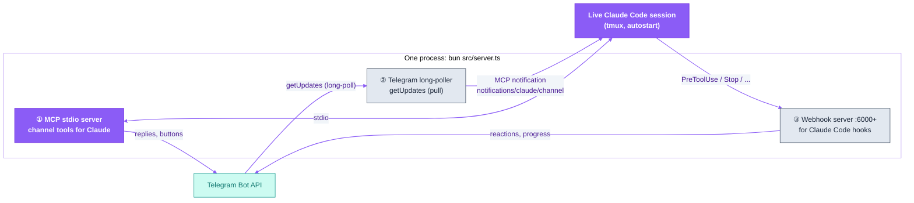
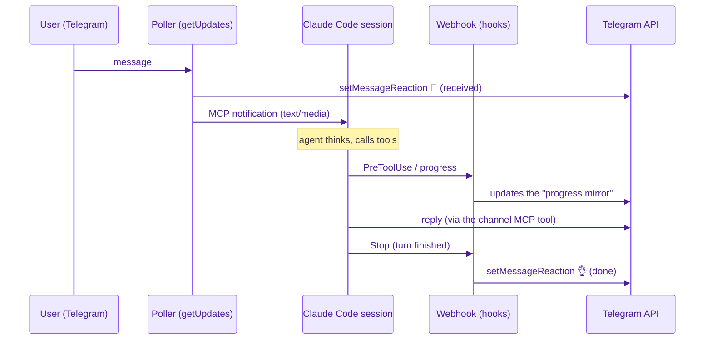

<p align="center">
  <picture>
    <source media="(prefers-color-scheme: dark)" srcset="assets/labops-logo-dark.svg">
    
  </picture>
</p>

<h1 align="center">labops-tg-plugin</h1>

<p align="center"><em>AI operations — from inside the profession</em></p>

<p align="center">
  <a href="https://labopsai.pro"></a>
  <a href="./LICENSE"></a>
  
</p>

<p align="center"><a href="README.md"><b>English</b></a> · <a href="README.ru.md">Русский</a></p>

<p align="center">
  <b>Part of labops:</b>
  <b>tg-plugin</b> ·
  <a href="https://github.com/dediukhinpa/labops-second-brain">second-brain</a> ·
  <a href="https://github.com/dediukhinpa/labops-agent-architecture">agent-architecture</a>
</p>

<p align="center">
  
</p>
<p align="center"><sub><i>Illustrative mockup of the two-stage reaction flow (👀 received → 👌 done) — not a screen recording.</i></sub></p>

---

## What it is

A Claude Code plugin (Bun runtime, TypeScript) that turns an ordinary `claude` session into a **long-lived Telegram agent**: your agent lives as a persistent session on a server and talks to you in Telegram — text, voice, media, status reactions, and interactive buttons. It registers as an **MCP server inside the live Claude Code session**, so Telegram is just an I/O channel — the same context, memory, and tools you already have, not a new headless process per message. Part of the **labops** architecture (see also [`labops-second-brain`](#part-of-labops) and [`labops-agent-architecture`](#part-of-labops)).

---

## Quickstart

**Prerequisites:** none — `install.sh` auto-installs `bun ≥ 1.3`, `tmux`,
`claude ≥ v2.1.80` if any is missing.

**Installed via [`labops-agent-architecture`](https://github.com/dediukhinpa/labops-agent-architecture)?** Its `install.sh` already cloned this repo to `~/labops-tg-plugin` — that's the plugin's one shared install (dependencies + hooks + tests). You don't touch this repo's files by hand: BotFather, the bot token, and each agent's own `channel.env` are handled per-agent, interactively, by `skills/create-agent/new-agent.sh`. Just run:

```bash
cd ~/labops-tg-plugin && ./install.sh
```

`new-agent.sh` then symlinks `~/labops-tg-plugin` into each new agent's workspace (`~/.claude-lab/<agent>/.claude/labops-tg-plugin`) automatically.

**Running this plugin standalone** (no `labops-agent-architecture`, no shared memory)? There's no `~/.claude-lab/<agent>/` layout to speak of — that's this architecture's own convention. Clone it inside **your own workspace's `.claude` folder** instead — wherever you already keep (or plan to keep) this agent's `CLAUDE.md`: a project repo root, or simply your home directory for a single global agent. Claude Code discovers `CLAUDE.md` by walking up from the plugin's working directory, so the plugin has to live inside that same tree — see [`docs/02-where-to-place-plugin.md`](docs/02-where-to-place-plugin.md) for why. Configure it by hand:

1. Create a bot via [@BotFather](https://t.me/BotFather) → get the token; get your own user_id via [@userinfobot](https://t.me/userinfobot) — step by step in [`docs/telegram-setup.md`](docs/telegram-setup.md).
2. Fill in `channel.env` with the minimal vars:
   - `TELEGRAM_BOT_TOKEN` — token from BotFather
   - `TELEGRAM_EXPECTED_BOT_ID` — the numeric part before `:` in the token (anti-spoof)
   - `TELEGRAM_ALLOWED_USER_IDS` — CSV of allowed user_ids
   - `TELEGRAM_ALLOWED_CHAT_IDS` — CSV of allowed chat_ids
   - `TELEGRAM_WORKSPACE_ROOT` — the agent's workspace root
   - `TELEGRAM_STATE_DIR` — per-agent state dir
3. Run `./install.sh` (installs dependencies and hooks, then runs the tests).

```bash
# Clone INSIDE your workspace's .claude folder (location is critical — see
# docs/02). <your-workspace> is wherever this agent's CLAUDE.md lives — a
# project root, or your home directory ($HOME) for a single global agent.
git clone <this-repo> <your-workspace>/.claude/labops-tg-plugin
cd <your-workspace>/.claude/labops-tg-plugin
./install.sh
```

> [!TIP]
> Incoming messages are pulled via **long-poll PULL** (`getUpdates`) — **no public IP/domain/TLS needed**.

> [!IMPORTANT]
> The "webhook server" is an internal `127.0.0.1` endpoint for routing Claude Code hooks, **not** a Telegram webhook.

The default mode is **single agent, private DMs only**; multichat (several chats/groups) is **opt-in**.

> [!NOTE]
> **Platform:** the target is **Linux + systemd**; on macOS/without systemd you can run it manually, but not as a service.

---

## Why a plugin, not a bot-over-API

A naive Telegram bot for an LLM spins up a fresh headless process (`claude -p` / Agent SDK) for every message, reloads context from scratch, and pays for it from a separate billing pool. That's expensive, slow, and has no memory between turns.

**labops-tg-plugin works differently:** it registers as an **MCP server inside a live Claude Code session**. There is a single session, kept running permanently (under tmux + autostart), and Telegram is just an input/output channel to it.

| | "Bot over API" (`claude -p`) | **labops-tg-plugin** |
|---|---|---|
| Process per message | a new one every time | one long-lived |
| Context between turns | lost / reloaded | preserved |
| Billing | separate SDK pool | your usual session/subscription |
| Memory, skills, hooks | must be wired up manually | work as in regular Claude Code |
| "Agent is thinking" status | none | reactions + progress mirror |

---

## Features

| Capability | What it does | Module |
|---|---|---|
| **Telegram channel** | receive/send messages for a long-lived session | `telegram/`, `router/` |
| **Long poll (pull)** | `getUpdates` long-poll — no public IP and no Telegram webhook | `telegram/poller.ts` |
| **Two-stage reactions** | 👀 "received" immediately, 👌 "done" at the end of the turn | `status/`, `telegram/handlers.ts` |
| **Voice** | receive voice → transcription → text to the agent (and voice reply, optional) | `telegram/media.ts` |
| **Media and albums** | photos/documents/attachment groups with buffering | `telegram/album-buffer.ts`, `media.ts` |
| **AskUserQuestion** | interactive option buttons right in Telegram | `channel/ask-user-question.ts` |
| **Permission prompt** | confirm dangerous actions (sudo, etc.) via buttons | `channel/permissions.ts` |
| **Progress mirror** | live "what the agent is doing now" status (terminal/tmux filter) | `status/`, `status/tmux-mirror.ts` |
| **Multichat** | one server serves several chats/threads | `router/multichat-router.ts` |
| **Turn memory** | writes turns to `active/episodic.md` + verbose-jsonl (optional) | `memory/` |
| **HTML filter** | safe conversion of terminal output to Telegram HTML | `safety/html-validator.ts`, `format/html.ts` |
| **Rate-limit & redact** | respects Telegram API limits, masks secrets | `safety/rate-limited-telegram-api.ts`, `safety/redact.ts` |

---

## Architecture: three "faces" of one process

A single Bun process (`src/server.ts`) plays three roles at once:



1. **MCP stdio server** — registered in the session's `.mcp.json` as `labops-channel`; gives Claude the channel tools (reply in chat, ask a question with buttons, request permission).
2. **Telegram long-poller** — pulls updates via `getUpdates` (**pull**, not webhook): no public IP/domain/TLS needed, works behind NAT. It hands an incoming message to the session as an **MCP notification** `notifications/claude/channel`.
3. **Internal webhook server** (`127.0.0.1:6000+`) — listens for **Claude Code hooks** (`PreToolUse`/`PostToolUse`/`Stop`, etc.) in order to draw reactions and the progress mirror. This is **not** a Telegram webhook — it's a purely local integration with hooks.

> [!IMPORTANT]
> An incoming message does NOT go through the webhook server. Poller → MCP notification → session. The webhook server is only triggered by the ephemeral hooks of the Claude Code session itself.

**Why this design:**

- **Plugin, not gateway.** The channel lives inside the session instead of spinning one up per turn. One context, one memory, one billing. (Details — [`docs/01-what-is-this.md`](docs/01-what-is-this.md).)
- **Pull (long-poll), not push (webhook).** `getUpdates` removes the need for a public inbound endpoint — the agent installs on any VPS behind NAT without a domain or certificate.
- **Separated control channels.** User input (Telegram → MCP notification) and lifecycle signals (Claude hooks → local webhook) take different paths and don't interfere.
- **Idempotent status.** Reactions/progress are a separate layer (`status/`) that only reflects state and is resilient to Telegram retries and rate-limits.
- **Secure by default.** Allowlist by user_id/chat_id, anti-spoof bot_id check, secret redaction on outbound, HTML validator — see [Security](#security).

### Incoming message flow



---

## Two-stage reactions 👀 → 👌

So the user can see the agent is alive and working:

- **👀 "received"** — set immediately when a message arrives (deterministically, in the poller), even before the agent starts thinking.
- **👌 "done"** — set on the `Stop` hook, when the turn is finished.

This is noticeably more responsive than "eyes-on-read" on the actual read event. The ✅/❌ symbols are **not** in Telegram's reaction whitelist — we use 👀/👌.

## Voice and media

- **Incoming voice/audio** is downloaded into the state dir's inbox and transcribed; the agent receives the text. The transcriber is plugged in separately (we recommend Groq `whisper-large-v3-turbo` — see [`labops-agent-architecture`](#part-of-labops), the voice skill).
- **Photos/documents/albums** are buffered (`album-buffer.ts`) and passed as turn attachments.
- Voice replies are optional (TTS is plugged in on the agent side).

## Multichat

One server routes several chats/threads through a session pool (`router/multichat-router.ts`, `router/tmux-session-pool.ts`). Enabling it and adding your own `user_id` — see `docs/01-what-is-this.md` and `examples/channel.env.example` (`TELEGRAM_ALLOWED_USER_IDS` / `TELEGRAM_ALLOWED_CHAT_IDS`).

---

## Configuration

<details>
<summary>Environment variables, commands, install details, and tests</summary>

### Environment variables

Full example — [`examples/channel.env.example`](examples/channel.env.example). It goes into `/etc/labops-plugin/<agent>/channel.env` (`chmod 640`, `chown root:<service-user>`). How to get the token and ids — [`docs/telegram-setup.md`](docs/telegram-setup.md).

> [!WARNING]
> Keep secrets out of git: `channel.env` with `chmod 640` and `chown root:<service-user>`, never committed.

| Variable | Purpose |
|---|---|
| `TELEGRAM_BOT_TOKEN` | token from [@BotFather](https://t.me/BotFather) |
| `TELEGRAM_EXPECTED_BOT_ID` | numeric part of the token before `:` (anti-spoof) |
| `TELEGRAM_ALLOWED_USER_IDS` | CSV of allowed user_ids |
| `TELEGRAM_ALLOWED_CHAT_IDS` | CSV of allowed chat_ids (groups — with `-100…`) |
| `TELEGRAM_WORKSPACE_ROOT` | the agent's workspace root (where `CLAUDE.md`, `core/`, `.mcp.json` live) |
| `AGENT_ID` | agent identifier (routing in multi-agent + logs) |
| `TELEGRAM_STATE_DIR` | agent state: `bot.pid`, `config.json`, inbox, logs (isolate per agent) |
| `TELEGRAM_WEBHOOK_HOST` / `_PORT` | local host/port for Claude hooks (a dedicated port per agent, `6000+`) |
| `TELEGRAM_MEMORY_ENABLED` | write turns to `active/episodic.md` + verbose-jsonl |
| `TELEGRAM_MEMORY_WORKSPACE` / `_AGENT_LABEL` / `_SOURCE_TAG` | turn-memory write parameters |

### Commands

- **Slash/OOB commands** are handled in `commands/oob.ts` (out-of-band channel control from chat).
- The agent's application-level commands (its skills, roles) live in its workspace (`CLAUDE.md`, skills) — that's the [`labops-agent-architecture`](#part-of-labops) layer, not the channel.

### Installation

Requirements: **Bun ≥ 1.3**, **Claude Code ≥ v2.1.80**, Linux/systemd (VPS) or macOS/launchd.

```bash
# Via labops-agent-architecture (recommended — one shared install, all agents symlink to it):
cd ~/labops-tg-plugin && ./install.sh

# Standalone (no labops-agent-architecture): clone INSIDE your own
# workspace's .claude folder instead — location is critical, see docs/02.
# <your-workspace> is wherever this agent's CLAUDE.md lives (a project root,
# or $HOME for a single global agent) — NOT a ~/.claude-lab/<agent>/ layout,
# that's labops-agent-architecture's own convention.
git clone <this-repo> <your-workspace>/.claude/labops-tg-plugin
cd <your-workspace>/.claude/labops-tg-plugin
./install.sh
```

`install.sh` is idempotent: it installs dependencies (`bun install`), registers the Claude Code hooks (`plugin/scripts/install-hooks.sh`), and **runs the repository tests at the end** — the install is considered successful only when the tests are green.

Next:
- [`docs/telegram-setup.md`](docs/telegram-setup.md) — bot setup checklist (token, user_id, group chat_id)
- [`docs/01-what-is-this.md`](docs/01-what-is-this.md) — concept and architecture
- [`docs/02-where-to-place-plugin.md`](docs/02-where-to-place-plugin.md) — **critical:** where to put the plugin
- [`docs/03-installation-linux.md`](docs/03-installation-linux.md) / [`docs/03-installation-macos.md`](docs/03-installation-macos.md)
- [`docs/05-troubleshooting.md`](docs/05-troubleshooting.md)
- [`docs/06-how-claude-loads-session.md`](docs/06-how-claude-loads-session.md) — where Claude looks for `settings.json` (a frequent source of "the hook silently didn't fire")

### Tests

```bash
# Functional plugin tests (TypeScript/Bun)
cd plugin && bun test

# Supervisor/webhook-listener/docs tests (Python)
python3 -m venv .venv && .venv/bin/pip install -r webhook-listener/requirements.txt pytest
.venv/bin/python -m pytest tests/ -q
```

`install.sh` runs them automatically at the end of installation.

</details>

---

## Security

| Mechanism | What it protects |
|---|---|
| **Allowlist** `TELEGRAM_ALLOWED_USER_IDS` / `_CHAT_IDS` | the bot replies only to allowed parties |
| **Anti-spoof** `TELEGRAM_EXPECTED_BOT_ID` | checks bot_id against the token — a foreign update is dropped |
| **Redaction** (`safety/redact.ts`) | masks secrets/tokens in outgoing messages |
| **HTML validator** (`safety/html-validator.ts`) | only a safe whitelist of tags in Telegram HTML |
| **Rate-limit** (`safety/rate-limited-telegram-api.ts`) | respects Telegram API limits without bans |
| **Secrets out of git** | `channel.env` with `chmod 640`, not committed |

---

## Data & privacy

Self-hosted by design: the plugin runs on the operator's own server, the data stays on their infrastructure, and there is no telemetry or analytics.

External endpoints actually used:

| Endpoint | Purpose | When |
|---|---|---|
| `api.telegram.org` | Telegram Bot API — send/receive messages, download attachments | While the channel is running |
| `api.groq.com` | Voice transcription (Whisper) via the configured provider | Only when a voice message arrives and `GROQ_API_KEY` is set |
| `127.0.0.1` (internal webhook) | Local IPC between Claude Code hooks and the channel server (read-receipts, progress, ask-user) | Local only — bound to loopback, never exposed off-host |

> [!NOTE]
> The only outbound traffic is to Telegram (and whatever provider the operator configures, e.g. voice transcription). Nothing else leaves the host.

Secrets live in `channel.env` (`chmod 640`, `chown root:<service-user>`) and are never committed to git.

---

## Part of labops

labops is three independent components:

| Repository | Role | Dependency |
|---|---|---|
| **labops-tg-plugin** (this) | Telegram channel to a live Claude Code session | self-contained |
| [**labops-second-brain**](https://github.com/dediukhinpa/labops-second-brain) | shared memory: Postgres+pgvector, MCP memory/memory_router/agent_router, memory layers | connects to the agent over MCP |
| [**labops-agent-architecture**](https://github.com/dediukhinpa/labops-agent-architecture) | agent workspaces, autostart/watchdog, the first agent **Developer** + an agent-creation skill, voice | uses this plugin and second-brain |

This plugin is self-contained (you can install a single Telegram agent without shared memory). The full architecture is in `labops-agent-architecture`.

> **Installed via `labops-agent-architecture`?** See [Quickstart](#quickstart) above —
> `cd ~/labops-tg-plugin && ./install.sh` is the one command you need; do it
> before creating your first agent, or `new-agent.sh` will warn that the
> Telegram channel isn't set up yet.

---

## License

Proprietary — © 2026 LabOps.ai. All rights reserved. See [LICENSE](./LICENSE).
