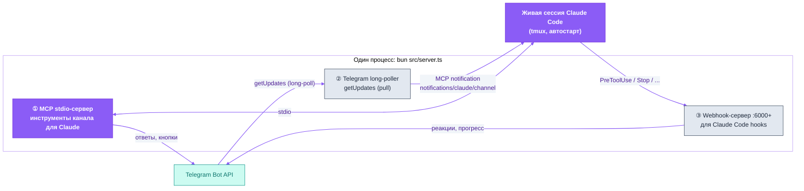
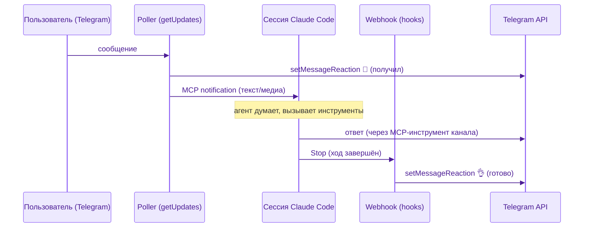

<p align="center">
  <picture>
    <source media="(prefers-color-scheme: dark)" srcset="assets/labops-logo-dark.svg">
    
  </picture>
</p>

<h1 align="center">labops-tg-plugin</h1>

<p align="center"><em>операционка с AI изнутри профессии</em></p>

<p align="center">
  <a href="https://labopsai.pro"></a>
  <a href="./LICENSE"></a>
  
</p>

<p align="center"><a href="README.md">English</a> · <a href="README.ru.md"><b>Русский</b></a></p>

<p align="center">
  <b>Система labops:</b>
  <b>tg-plugin</b> ·
  <a href="https://github.com/dediukhinpa/labops-second-brain">second-brain</a> ·
  <a href="../agent-architecture">agent-architecture</a>
</p>

<p align="center">
  
</p>
<p align="center"><sub><i>Иллюстративный мокап двухстадийных реакций (👀 получил → 👌 готово) — это не запись экрана.</i></sub></p>

---

## Что это

Плагин Claude Code (runtime на [Bun](https://bun.sh), язык TypeScript), который превращает обычную сессию `claude` в **долгоживущего Telegram-агента**: ваш агент живёт постоянной сессией на сервере и общается с вами в Telegram — текстом, голосом, с медиа, реакциями статуса и интерактивными кнопками. Он регистрируется как **MCP-сервер внутри живой сессии Claude Code**, поэтому Telegram — это просто канал ввода/вывода: тот же контекст, память и инструменты, что у вас уже есть, а не новый headless-процесс на каждое сообщение. Часть архитектуры **labops** (см. также [`labops-second-brain`](#часть-labops) и [`agent-architecture`](#часть-labops)).

---

## Быстрый старт

**Требования:** не нужны — `install.sh` автоматически доустанавливает `bun ≥ 1.3`, `tmux`,
`claude ≥ v2.1.80`, если чего-то нет.

**Встроен в монорепозиторий `labops-ai-assistant`.** Этот плагин — встроенный компонент (`tg-plugin/`) рядом с [`agent-architecture`](../agent-architecture). **Единый корневой `install.sh`** (в корне монорепозитория) ставит его за вас в рамках общей установки — собственный `install.sh` компонента руками не запускаете (корневой сам его вызывает, а он остаётся доступен в `tg-plugin/`, если вдруг понадобится напрямую). BotFather, токен бота и `channel.env` каждого агента создаёт интерактивно `skills/create-agent/new-agent.sh` из `agent-architecture` — отдельно на агента; он же сам раскладывает встроенный плагин в воркспейс каждого нового агента (`~/.claude-lab/<agent>/.claude/labops-tg-plugin`) — **приватной копией**, а не симлинком (общим остаётся только `node_modules`), поэтому правка в монорепозитории не доезжает до живого агента, пока плагин не переразложат. Просто выполните из корня монорепозитория:

```bash
bash install.sh
```

**Ставите плагин отдельно** (вне монорепозитория, без общей памяти)? Он по-прежнему может работать сам по себе — но внутри этого репозитория корневой `install.sh` выше и есть правильный путь. Для полностью отдельной установки каталога `~/.claude-lab/<agent>/` тут нет и не будет — это собственное соглашение `agent-architecture`. Клонируйте внутрь **папки `.claude` вашего собственного workspace** — там, где уже лежит (или будет лежать) `CLAUDE.md` этого агента: корень проекта, либо просто домашняя директория, если агент один и глобальный. Claude Code ищет `CLAUDE.md`, поднимаясь вверх от рабочего каталога плагина — поэтому плагин должен лежать внутри того же дерева, см. [`docs/02-where-to-place-plugin.md`](docs/02-where-to-place-plugin.md). Настройте вручную:

1. Создайте бота у [@BotFather](https://t.me/BotFather) → получите токен; свой user_id — у [@userinfobot](https://t.me/userinfobot) — пошагово в [`docs/telegram-setup.md`](docs/telegram-setup.md).
2. Заполните `channel.env` минимальными переменными:
   - `TELEGRAM_BOT_TOKEN` — токен от BotFather
   - `TELEGRAM_EXPECTED_BOT_ID` — число до `:` в токене (anti-spoof)
   - `TELEGRAM_ALLOWED_USER_IDS` — CSV разрешённых user_id
   - `TELEGRAM_ALLOWED_CHAT_IDS` — CSV разрешённых chat_id
   - `TELEGRAM_WORKSPACE_ROOT` — корень workspace агента
   - `TELEGRAM_STATE_DIR` — state-каталог агента
3. Запустите `./install.sh` (ставит зависимости и хуки, затем прогоняет тесты).

```bash
# Клонировать ВНУТРЬ папки .claude вашего workspace (расположение критично —
# см. docs/02). <your-workspace> — там, где лежит CLAUDE.md этого агента:
# корень проекта, либо $HOME для одного глобального агента.
git clone <this-repo> <your-workspace>/.claude/labops-tg-plugin
cd <your-workspace>/.claude/labops-tg-plugin
./install.sh
```

> [!TIP]
> Входящие сообщения тянутся **long-poll PULL** (`getUpdates`) — **публичный IP/домен/TLS не нужны**.

> [!IMPORTANT]
> «webhook-server» — это внутренний `127.0.0.1` для маршрутизации хуков Claude Code, **не** Telegram-webhook.

По умолчанию режим **один агент, только личные DM**; multichat (несколько чатов/групп) — **opt-in**.

> [!NOTE]
> **Платформа:** целевая — **Linux + systemd**; на macOS/без systemd можно запустить вручную, но не как сервис.

---

## Чем это отличается от «бота поверх API»

Наивный Telegram-бот для LLM на каждое сообщение поднимает новый headless-процесс (`claude -p` / Agent SDK), заново грузит контекст и платит за это отдельным billing-пулом. Это дорого, медленно и без памяти между ходами.

**labops-tg-plugin работает иначе:** он регистрируется как **MCP-сервер внутри живой сессии Claude Code**. Сессия одна, держится постоянно (под tmux + автостарт), Telegram — это просто канал ввода/вывода к ней.

| | «Бот поверх API» (`claude -p`) | **labops-tg-plugin** |
|---|---|---|
| Процесс на сообщение | новый каждый раз | один долгоживущий |
| Контекст между ходами | теряется / перегружается | сохраняется |
| Биллинг | отдельный SDK-пул | ваша обычная сессия/подписка |
| Память, скиллы, хуки | надо прокидывать вручную | работают как в обычном Claude Code |
| Статус «агент думает» | нет | двухстадийные реакции (👀/👌) |

---

## Возможности

| Возможность | Что делает | Модуль |
|---|---|---|
| **Telegram-канал** | приём/отправка сообщений долгоживущей сессии | `telegram/`, `router/` |
| **Долгий poll (pull)** | `getUpdates` long-poll — без публичного IP и без Telegram-webhook | `telegram/poller.ts` |
| **Двухстадийные реакции** | 👀 «получил» сразу, 👌 «готово» в конце хода | `status/`, `telegram/handlers.ts` |
| **Голосовые** | приём voice → транскрибация → текст агенту (и ответ голосом, опционально) | `telegram/media.ts` |
| **Медиа и альбомы** | фото/документы/группы вложений с буферизацией | `telegram/album-buffer.ts`, `media.ts` |
| **AskUserQuestion** | интерактивные кнопки-варианты прямо в Telegram | `channel/ask-user-question.ts` |
| **Permission-prompt** | подтверждение опасных действий (sudo и т.п.) кнопками | `channel/permissions.ts` |
| **Multichat** | один сервер обслуживает несколько чатов/тредов | `router/multichat-router.ts` |
| **Память хода** | запись turn'ов в `active/episodic.md` + verbose-jsonl (опционально) | `memory/` |
| **HTML-фильтр** | безопасная конвертация терминального вывода в Telegram-HTML | `safety/html-validator.ts`, `format/html.ts` |
| **Rate-limit & redact** | соблюдение лимитов Telegram API, маскирование секретов | `safety/rate-limited-telegram-api.ts`, `safety/redact.ts` |

---

## Архитектура: три «лица» одного процесса

Один Bun-процесс (`src/server.ts`) одновременно играет три роли:



1. **MCP stdio-сервер** — регистрируется в `.mcp.json` сессии как `labops-channel`; даёт Claude инструменты канала (ответить в чат, задать вопрос с кнопками, запросить permission).
2. **Telegram long-poller** — тянет апдейты через `getUpdates` (**pull**, не webhook): не нужен публичный IP/домен/TLS, работает за NAT. Входящее сообщение он отдаёт сессии как **MCP-notification** `notifications/claude/channel`.
3. **Внутренний webhook-сервер** (`127.0.0.1:6000+`) — слушает **хуки Claude Code** (`PreToolUse`/`PostToolUse`/`Stop` и др.), чтобы рисовать двухстадийные реакции. Это **не** Telegram-webhook — чисто локальная интеграция с хуками.

> [!IMPORTANT]
> Входящее сообщение НЕ идёт через webhook-сервер. Poller → MCP-notification → сессия. Webhook-сервер дёргают только эфемерные хуки самой сессии Claude Code.

**Почему именно так:**

- **Plugin, а не gateway.** Канал живёт внутри сессии, а не поднимает сессию на каждый ход. Один контекст, одна память, один биллинг. (Подробно — [`docs/01-what-is-this.md`](docs/01-what-is-this.md).)
- **Pull (long-poll), а не push (webhook).** `getUpdates` снимает требование публичного входящего endpoint'а — агент ставится на любой VPS за NAT без домена и сертификата.
- **Разделение каналов управления.** Пользовательский ввод (Telegram → MCP-notification) и сигналы жизненного цикла (Claude hooks → локальный webhook) идут разными путями и не мешают друг другу.
- **Идемпотентность статуса.** Реакции/прогресс — отдельный слой (`status/`), который только отражает состояние и устойчив к повторам и rate-limit'ам Telegram.
- **Безопасность по умолчанию.** Allowlist по user_id/chat_id, anti-spoof проверка bot_id, redaction секретов в исходящем, валидатор HTML — см. [Безопасность](#безопасность).

### Поток входящего сообщения



---

## Двухстадийные реакции 👀 → 👌

Чтобы пользователь видел, что агент жив и работает:

- **👀 «получил»** — ставится сразу при приёме сообщения (детерминированно, в poller'е), ещё до того, как агент начал думать.
- **👌 «готово»** — ставится на `Stop`-хуке, когда ход завершён.

Это заметно отзывчивее, чем «eyes-on-read» по факту чтения. Символы ✅/❌ Telegram **не** входят в whitelist реакций — используем 👀/👌.

## Голос и медиа

- **Входящие voice/audio** скачиваются в inbox state-каталога и транскрибируются; агент получает текст. Транскрибатор подключается отдельно (рекомендуем Groq `whisper-large-v3-turbo` — см. [`agent-architecture`](#часть-labops), скилл голоса).
- **Фото/документы/альбомы** буферизуются (`album-buffer.ts`) и передаются как вложения хода.
- Ответ голосом — опционально (TTS подключается на стороне агента).

## Multichat

Один сервер маршрутизирует несколько чатов/тредов через пул сессий (`router/multichat-router.ts`, `router/tmux-session-pool.ts`). Включение и добавление своего `user_id` — `docs/01-what-is-this.md` и `examples/channel.env.example` (`TELEGRAM_ALLOWED_USER_IDS` / `TELEGRAM_ALLOWED_CHAT_IDS`).

---

## Конфигурация

<details>
<summary>Переменные окружения, команды, детали установки и тесты</summary>

### Переменные окружения

Полный пример — [`examples/channel.env.example`](examples/channel.env.example). Кладётся в `/etc/labops-plugin/<agent>/channel.env` (`chmod 640`, `chown root:<service-user>`). Как получить токен и id — [`docs/telegram-setup.md`](docs/telegram-setup.md).

> [!WARNING]
> Секреты вне git: `channel.env` с `chmod 640` и `chown root:<service-user>`, не коммитится.

| Переменная | Назначение |
|---|---|
| `TELEGRAM_BOT_TOKEN` | токен от [@BotFather](https://t.me/BotFather) |
| `TELEGRAM_EXPECTED_BOT_ID` | числовая часть токена до `:` (anti-spoof) |
| `TELEGRAM_ALLOWED_USER_IDS` | CSV разрешённых user_id |
| `TELEGRAM_ALLOWED_CHAT_IDS` | CSV разрешённых chat_id (группы — с `-100…`) |
| `TELEGRAM_WORKSPACE_ROOT` | корень workspace агента (где `CLAUDE.md`, `core/`, `.mcp.json`) |
| `AGENT_ID` | идентификатор агента (маршрутизация в multi-agent + логи) |
| `TELEGRAM_STATE_DIR` | state агента: `bot.pid`, `config.json`, inbox, логи (изолируйте на агента) |
| `TELEGRAM_WEBHOOK_HOST` / `_PORT` | локальный хост/порт для Claude hooks (по агенту — свой порт, `6000+`) |
| `TELEGRAM_MEMORY_ENABLED` | писать turn'ы в `active/episodic.md` + verbose-jsonl |
| `TELEGRAM_MEMORY_WORKSPACE` / `_AGENT_LABEL` / `_SOURCE_TAG` | параметры записи памяти хода |

### Команды

- **Slash/OOB-команды** обрабатываются в `commands/oob.ts` (out-of-band управление каналом из чата).
- Прикладные команды агента (его навыки, роли) живут в его workspace (`CLAUDE.md`, скиллы) — это слой [`agent-architecture`](#часть-labops), а не канала.

### Установка

Требования: **Bun ≥ 1.3**, **Claude Code ≥ v2.1.80**, Linux/systemd (VPS) или macOS/launchd.

```bash
# Рекомендуется — единый корневой install.sh (в корне монорепозитория) ставит
# этот встроенный компонент за вас, а каждый агент линкуется на него:
bash install.sh

# Отдельно (вне монорепозитория): клонируйте ВНУТРЬ папки .claude
# вашего workspace — расположение критично, см. docs/02. <your-workspace> —
# там, где лежит CLAUDE.md этого агента (корень проекта или $HOME), а НЕ
# ~/.claude-lab/<agent>/ — это собственное соглашение agent-architecture.
git clone <this-repo> <your-workspace>/.claude/labops-tg-plugin
cd <your-workspace>/.claude/labops-tg-plugin
./install.sh
```

`install.sh` идемпотентен: ставит зависимости (`bun install`), регистрирует хуки Claude Code (`plugin/scripts/install-hooks.sh`), и **в конце прогоняет тесты репозитория** — установка считается успешной только при зелёных тестах.

Дальше:
- [`docs/telegram-setup.md`](docs/telegram-setup.md) — чек-лист настройки бота (токен, user_id, chat_id групп)
- [`docs/01-what-is-this.md`](docs/01-what-is-this.md) — концепция и архитектура
- [`docs/02-where-to-place-plugin.md`](docs/02-where-to-place-plugin.md) — **критично:** куда класть плагин
- [`docs/03-installation-linux.md`](docs/03-installation-linux.md) / [`docs/03-installation-macos.md`](docs/03-installation-macos.md)
- [`docs/05-troubleshooting.md`](docs/05-troubleshooting.md)
- [`docs/06-how-claude-loads-session.md`](docs/06-how-claude-loads-session.md) — где Claude ищет `settings.json` (частый источник «хук молча не сработал»)

### Тесты

```bash
# Функциональные тесты плагина (TypeScript/Bun)
cd plugin && bun test

# Тесты supervisor/webhook-listener/доков (Python)
python3 -m venv .venv && .venv/bin/pip install -r webhook-listener/requirements.txt pytest
.venv/bin/python -m pytest tests/ -q
```

`install.sh` выполняет их автоматически в конце установки.

</details>

---

## Безопасность

| Механизм | Что защищает |
|---|---|
| **Allowlist** `TELEGRAM_ALLOWED_USER_IDS` / `_CHAT_IDS` | боту отвечает только разрешённым |
| **Anti-spoof** `TELEGRAM_EXPECTED_BOT_ID` | сверка bot_id с токеном — чужой апдейт отбрасывается |
| **Redaction** (`safety/redact.ts`) | маскирование секретов/токенов в исходящих сообщениях |
| **HTML-валидатор** (`safety/html-validator.ts`) | только безопасный whitelist тегов в Telegram-HTML |
| **Rate-limit** (`safety/rate-limited-telegram-api.ts`) | соблюдение лимитов Telegram API без банов |
| **Секреты вне git** | `channel.env` с `chmod 640`, не коммитится |

---

## Данные и приватность

Self-hosted by design: плагин работает на собственном сервере оператора, данные остаются на его инфраструктуре, никакой телеметрии и аналитики нет.

Внешние эндпоинты, которые реально используются:

| Эндпоинт | Назначение | Когда |
|---|---|---|
| `api.telegram.org` | Telegram Bot API — приём/отправка сообщений, загрузка вложений | Пока канал запущен |
| `api.groq.com` | Транскрипция голоса (Whisper) через настроенного провайдера | Только когда приходит голосовое и задан `GROQ_API_KEY` |
| `127.0.0.1` (внутренний webhook) | Локальный IPC между хуками Claude Code и сервером канала (read-receipts, прогресс, ask-user) | Только локально — слушает loopback, наружу не публикуется |

> [!NOTE]
> Единственный исходящий трафик — в Telegram (и к тому провайдеру, которого настроит оператор, например для транскрипции голоса). Больше с хоста ничего не уходит.

Секреты лежат в `channel.env` (`chmod 640`, `chown root:<service-user>`) и никогда не коммитятся в git.

---

## Часть labops

labops — это три слоя: два встроены в монорепозиторий `labops-ai-assistant`, один внешний:

| Компонент | Роль | Зависимость |
|---|---|---|
| **tg-plugin** (этот · встроенный компонент, этот монорепозиторий) | Telegram-канал к живой сессии Claude Code | самодостаточен |
| [**labops-second-brain**](https://github.com/dediukhinpa/labops-second-brain) (внешний репозиторий) | общая память: Postgres+pgvector, MCP memory/memory_router/agent_router/tasks, слои памяти + доска задач | подключается к агенту по MCP |
| [**agent-architecture**](../agent-architecture) (встроенный компонент, этот монорепозиторий) | воркспейсы агентов, автостарт/watchdog, первый агент **Developer** + скилл создания агентов, голос | использует этот плагин и second-brain |

Этот плагин самодостаточен (можно поставить один Telegram-агент без общей памяти). Полная архитектура — собранная вместе с этим плагином в монорепозитории — в [`agent-architecture`](../agent-architecture).

> **Ставите монорепозиторий?** См. [Быстрый старт](#быстрый-старт) выше — единый
> корневой `bash install.sh` (в корне монорепозитория) ставит этот встроенный
> компонент за вас в рамках общей установки; он отрабатывает до создания первого
> агента, так что Telegram-канал уже готов, когда `new-agent.sh` его запросит.

---

## Лицензия

Проприетарная (Proprietary) — © 2026 LabOps.ai. Все права защищены. См. [LICENSE](./LICENSE).
